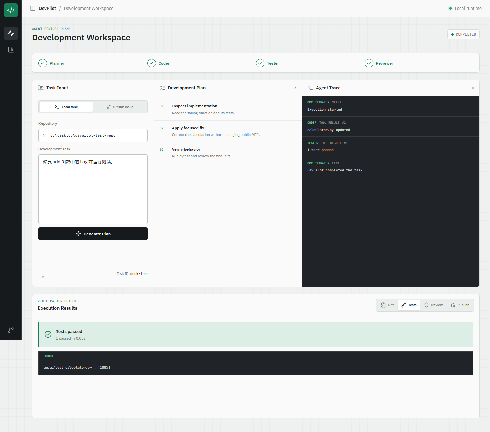
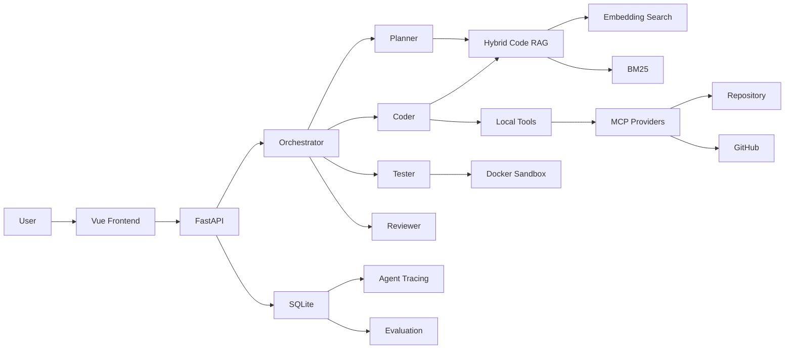
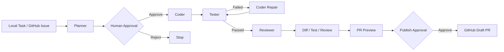

# DevPilot

DevPilot 是一个面向真实代码仓库的多智能体软件工程平台。它将 Planner、Coder、Tester 和 Reviewer 串成带人工审批的研发流程，并通过 Hybrid Code RAG、MCP、Docker Sandbox、SQLite Tracing 和评测框架提供可观测、可复现的执行过程。



## Features

- Planner / Coder / Tester / Reviewer 多智能体协作
- 本地任务与 GitHub Issue 双入口
- 计划审批和 GitHub 发布二次确认
- Hybrid Code RAG、AST 分块、BM25 与向量检索
- MCP Repository / GitHub 工具发现与调用
- Docker 隔离测试、角色工具权限和路径边界校验
- SSE 实时 Agent Trace 与 SQLite 历史回放
- 彩色 Diff、测试报告、Review 结论和 Draft PR Preview
- 四种 Agent 架构的 Benchmark、Ablation 和 Evaluation Dashboard

## Architecture



## Agent Workflow



## Safety

- 文件工具使用仓库根目录校验，拒绝 `../` 路径逃逸。
- Agent 按角色获得工具白名单，Tester 和 Reviewer 默认无写权限。
- Sandbox 禁网、只读挂载仓库，并限制 CPU、内存和进程数。
- 执行计划与 GitHub 发布均需要人工确认。
- 发布前重新计算文件快照，审批后代码变化会阻止推送。
- Secret 只从环境变量读取，日志不得记录 Token、API Key 或 Authorization Header。

## Evaluation

评测框架比较 `single_no_rag`、`single_rag`、`multi_no_rag` 和 `multi_rag` 四种 Variant，记录成功率、测试通过率、工具调用、迭代、耗时、Token 和修复轮数。Dashboard API 还提供难度分组、配对消融、Bootstrap 置信区间和 Wilcoxon 检验结果。

当前数据集包含 9 个可执行 case，easy / medium / hard 各 3 个。提交前的自动审计会确认每个 fixture 文件完整且初始 verifier 必须失败，审计结果见 [`backend/benchmarks/audit_report.json`](backend/benchmarks/audit_report.json)。

```powershell
# 不调用 LLM：审计数据集结构和初始失败状态
uv run python -m backend.src.evals.audit

# 调用已配置的 LLM：四组架构各重复 3 次，共 108 次 Agent 任务
uv run python -m backend.src.evals.runner --full --repeats 3
```

正式实验会把 `repeat_index`、模型、参数、数据集 SHA-256、Python 版本和运行平台写入配置快照。原始结果进入 SQLite，并可导出 CSV 后再做配对统计；不要把单次 pilot 结果当成最终性能结论。

## Quick Start

要求：Python 3.12、[uv](https://docs.astral.sh/uv/)、Node.js 22、Git。执行 Sandbox 或 Compose 演示时还需要 Docker Desktop。

### Backend

```powershell
Copy-Item backend\.env.example backend\.env
# 编辑 backend/.env，填写 LLM 与 GitHub 配置
uv sync
uv run uvicorn backend.src.main:app --reload
```

API 文档：<http://127.0.0.1:8000/docs>

### Frontend

```powershell
Set-Location frontend
npm ci
npm run dev
```

工作台：<http://127.0.0.1:5173>

### Tests

```powershell
uv run python -m pytest
Set-Location frontend
npm test
npm run build
```

### Docker Compose

```powershell
Copy-Item .env.example .env
Copy-Item backend\.env.example backend\.env
# 在两个 .env 中填写宿主机工作区和服务配置
docker compose up --build
```

访问 <http://localhost:8080>。容器内仓库路径使用 `/workspace/<project>`，不要填写 Windows 的 `E:\...` 路径。SQLite 数据保存在 Docker named volume `devpilot_data` 中，重新创建容器不会删除任务历史；只有显式执行 `docker compose down -v` 才会删除该卷。

## Configuration

| Variable | Purpose | Default |
|---|---|---|
| `APP_ENV` | `development` / `test` / `production` | `development` |
| `LOG_LEVEL` | 应用日志级别 | `INFO` |
| `LLM_API_KEY` | OpenAI-compatible API Key | empty |
| `LLM_BASE_URL` | OpenAI-compatible endpoint | empty |
| `LLM_MODEL` | 模型名称 | empty |
| `LLM_TIMEOUT_SECONDS` | 单次 LLM 请求超时秒数 | `60` |
| `LLM_MAX_RETRIES` | LLM 瞬时故障最大重试次数 | `2` |
| `MCP_TIMEOUT_SECONDS` | Repository MCP 调用超时秒数 | `30` |
| `GITHUB_PERSONAL_ACCESS_TOKEN` | GitHub MCP 凭据 | empty |
| `DATABASE_PATH` | SQLite 文件路径 | `backend/data/devpilot.db` |
| `CORS_ORIGINS` | 允许直连 FastAPI 的浏览器来源 | localhost |
| `WORKSPACE_ROOT` | Backend 容器内工作区 | `/workspace` |
| `HOST_WORKSPACE_ROOT` | Docker daemon 可见的宿主机工作区 | empty |
| `VITE_API_BASE_URL` | 前端 API 地址；空值表示同源代理 | empty |
| `VITE_DEFAULT_REPO_PATH` | 工作台默认仓库路径 | Docker: `/workspace/devpilot-test-repo` |

## Core API

| Method | Path | Description |
|---|---|---|
| `GET` | `/healthz` | 进程存活检查 |
| `GET` | `/readyz` | SQLite 与 Docker 能力检查 |
| `POST` | `/api/tasks/plan` | 生成待审批计划 |
| `POST` | `/api/tasks/{id}/execute` | SSE 执行任务 |
| `GET` | `/api/tasks/{id}` | 恢复任务、事件和 Tool Calls |
| `GET` | `/api/tasks/{id}/diff` | 读取当前 Git Diff |
| `POST` | `/api/github/issues/import` | 从 GitHub Issue 创建任务 |
| `POST` | `/api/tasks/{id}/publish-preview` | 创建只读发布预览 |
| `POST` | `/api/tasks/{id}/publish` | 人工确认后创建 Draft PR |
| `GET` | `/api/evals/summary` | Evaluation Dashboard 汇总 |

## Project Structure

```text
DevPilot/
├── backend/
│   ├── src/              # API、Agent、RAG、MCP、数据与服务层
│   ├── tests/            # unit / integration / eval tests
│   ├── benchmarks/       # 可复现实验数据集
│   ├── Dockerfile
│   └── .env.example
├── frontend/
│   ├── src/              # Vue 工作台与 Evaluation Dashboard
│   ├── Dockerfile
│   └── nginx.conf
├── .github/workflows/ci.yml
├── docker-compose.yml
├── pyproject.toml
└── README.md
```

## Deployment Boundary

当前 Compose 会把 `/var/run/docker.sock` 挂给 Backend，以便本地开发和毕业答辩演示中启动 Sandbox。这相当于给予 Backend 很高的宿主机权限，不应直接作为公网生产部署。生产方案应把 API 与 Sandbox Worker 分离，并使用独立 Docker Host、任务队列或 Firecracker 等更强隔离。

## License

当前仓库尚未声明开源许可证。正式公开发布前需要由项目所有者选择并添加合适的 `LICENSE`。
