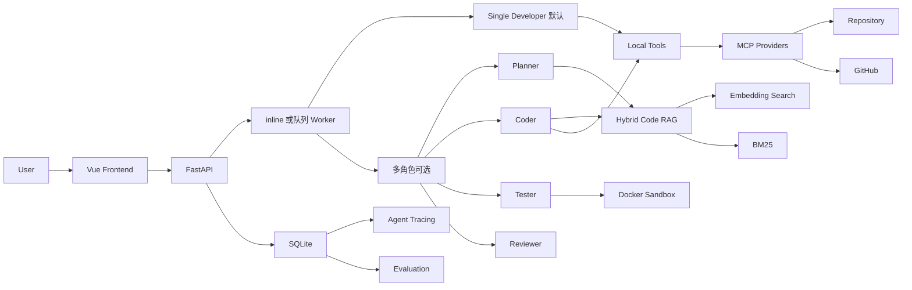
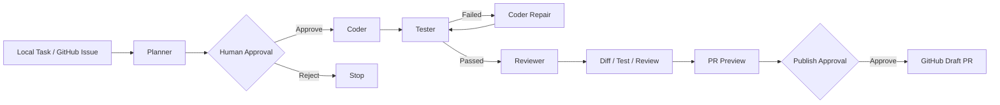

# DevPilot

DevPilot 是一个面向真实代码仓库的多智能体软件工程平台。它将 Planner、Coder、Tester 和 Reviewer 串成带人工审批的研发流程，并通过 Hybrid Code RAG、MCP、Docker Sandbox、SQLite Tracing 和评测框架提供可观测、可复现的执行过程。

系统化学习项目设计、核心实现与实验结论，请阅读 [`docs/technical-handbook.md`](docs/technical-handbook.md)。


## Features

- 单 Agent 默认执行，以及 Planner / Coder / Tester / Reviewer 多智能体对照模式
- 本地任务与 GitHub Issue 双入口
- 计划审批和 GitHub 发布二次确认
- Hybrid Code RAG、AST 分块、BM25 与向量检索；支持按仓库规模与查询歧义动态启用（`RAG_MODE=auto`）
- 运行时协议探针工具（`protocol_probe`）：引导模型在沙箱内验证迭代器、异常边界与兼容行为
- 工具观测去重与摘要、Prompt Cache 命中统计，持续压低长任务 Token 成本
- 上下文断点恢复：服务重启后 resume 优先恢复中断前的模型上下文；恢复消息后编排流程仍会重新进入，工具可能重放
- MCP Repository / GitHub 工具发现与调用
- Docker 隔离测试、角色工具权限和路径边界校验
- 持久化任务队列与独立 Sandbox Worker（`TASK_QUEUE_BACKEND=sqlite|redis`，租约 / 心跳 / 幂等），支持 API 与执行分离部署
- 后台执行、协作式取消、重启恢复、SSE 断线续传与 SQLite Trace
- 彩色 Diff、测试报告、Review 结论和 Draft PR Preview
- 四种 Agent 架构的 Benchmark、Ablation 和 Evaluation Dashboard，覆盖 TypeScript / Java 与跨文件大型 Issue

## Architecture


```mermaid
flowchart LR
    User --> UI[Vue Frontend]
    UI --> API[FastAPI]
    API --> Dispatch[inline 或队列 Worker]
    Dispatch --> Single[Single Developer 默认]
    Dispatch --> Orchestrator[多角色可选]
    Single --> Tools
    Orchestrator --> Planner
    Orchestrator --> Coder
    Orchestrator --> Tester
    Orchestrator --> Reviewer
    Planner --> RAG[Hybrid Code RAG]
    Coder --> RAG
    RAG --> Vector[Embedding Search]
    RAG --> BM25
    Coder --> Tools[Local Tools]
    Tester --> Sandbox[Docker Sandbox]
    Tools --> MCP[MCP Providers]
    MCP --> Repository
    MCP --> GitHub
    API --> SQLite
    SQLite --> Trace[Agent Tracing]
    SQLite --> Eval[Evaluation]
```

## Agent Workflow

下图是可选多角色模式。默认 `single_no_rag` 在计划批准后由一个 Single Developer 完成阅读、修改和测试，不经过独立 Tester/Reviewer。


```mermaid
flowchart LR
    Input[Local Task / GitHub Issue] --> Plan[Planner]
    Plan --> Approval{Human Approval}
    Approval -->|Approve| Coder
    Approval -->|Reject| Stop[Stop]
    Coder --> Tester
    Tester -->|Failed| Repair[Coder Repair]
    Repair --> Tester
    Tester -->|Passed| Reviewer
    Reviewer --> Results[Diff / Test / Review]
    Results --> Preview[PR Preview]
    Preview --> Publish{Publish Approval}
    Publish -->|Approve| PR[GitHub Draft PR]
```

## Safety

当前 API 未提供用户鉴权与多租户隔离，仅适用于可信本地环境。`completed` 表示执行流程正常结束，不等于独立测试通过；只有评测器的 verifier 有独立判分。生产限制及本次核查见 [项目复核](docs/project-review.md)。

- 文件工具使用仓库根目录校验，拒绝 `../` 路径逃逸。
- Agent 按角色获得工具白名单，Tester 和 Reviewer 默认无写权限。
- Sandbox 禁网、只读挂载仓库，并限制 CPU、内存和进程数。
- 执行计划与 GitHub 发布均需要人工确认。
- 发布前重新计算文件快照，审批后代码变化会阻止推送。
- Secret 只从环境变量读取，日志不得记录 Token、API Key 或 Authorization Header。

## Evaluation

评测框架比较 `single_no_rag`、`single_rag`、`multi_no_rag` 和 `multi_rag` 四种 Variant，记录成功率、测试通过率、工具调用、迭代、耗时、Token 和修复轮数。Dashboard API 还提供难度分组、配对消融、Bootstrap 置信区间和 Wilcoxon 检验结果。

当前数据集包含 12 个可执行 case：9 个 Python 基础 case（easy / medium / hard 各 3 个），以及 3 个跨语言 / 跨文件 case（TypeScript、Java、Python 跨模块大型 Issue），用于验证 10.2.7 的跨语言能力。提交前的自动审计会确认每个 fixture 文件完整且初始 verifier 必须失败，审计结果见 [`backend/benchmarks/audit_report.json`](backend/benchmarks/audit_report.json)。TypeScript / Java 用例需要先构建 polyglot 沙箱镜像：`docker build --target polyglot -t devpilot-sandbox:polyglot -f backend/docker/sandbox.Dockerfile backend/docker`。

项目还提供 SWE-bench Lite dev 真实缺陷的受控评测：首轮 3 题对照，第五轮抽样 20 题、其中 11 题通过校准并各运行 3 次，以及文件级 RAG 检索评测。真实评测使用官方实例镜像、固定 base commit、基线/金补丁校准，并排除候选测试改动。当前实测结论与限制见 [`docs/current-evaluation.md`](docs/current-evaluation.md)。

```powershell
# 不调用 LLM：审计数据集结构和初始失败状态
uv run python -m backend.src.evals.audit

# 不调用 LLM：评测文件级 RAG 的 Recall@5、MRR 与延迟
uv run python -m backend.src.evals.retrieval --top-k 5

# 调用已配置的 LLM：四组架构各重复 3 次，当前 12 × 4 × 3，共 144 次 Agent 任务
uv run python -m backend.src.evals.runner --full --repeats 3

# 调用 LLM 和 Docker：运行小规模 SWE-bench Lite 真实缺陷评测
uv run python -m backend.src.evals.real_world
```

正式实验会把 `repeat_index`、模型、参数、数据集 SHA-256、Python 版本和运行平台写入配置快照。原始结果进入 SQLite，并可导出 CSV 后再做配对统计；不要把单次 pilot 结果当成最终性能结论。

## Quick Start

要求：Python 3.12、[uv](https://docs.astral.sh/uv/)、Node.js 22、Git。执行 Sandbox 或 Compose 演示时还需要 Docker Desktop。

### Backend

```powershell
Copy-Item backend\.env.example backend\.env
# 编辑 backend/.env，填写 LLM 与 GitHub 配置
uv sync
uv run uvicorn backend.src.main:app --reload
```

API 文档：<http://127.0.0.1:8000/docs>

### Frontend

```powershell
Set-Location frontend
npm ci
npm run dev
```

工作台：<http://127.0.0.1:5173>

### Tests

```powershell
uv run python -m pytest
Set-Location frontend
npm test
npm run build
```

### Docker Compose

```powershell
Copy-Item .env.example .env
Copy-Item backend\.env.example backend\.env
# 在两个 .env 中填写宿主机工作区和服务配置
docker compose up --build
```

访问 <http://localhost:8080>。容器内仓库路径使用 `/workspace/<project>`，不要填写 Windows 的 `E:\...` 路径。SQLite 数据保存在 Docker named volume `devpilot_data` 中，重新创建容器不会删除任务历史；只有显式执行 `docker compose down -v` 才会删除该卷。

## Configuration

| Variable | Purpose | Default |
|---|---|---|
| `APP_ENV` | `development` / `test` / `production` | `development` |
| `LOG_LEVEL` | 应用日志级别 | `INFO` |
| `LLM_API_KEY` | OpenAI-compatible API Key | empty |
| `LLM_BASE_URL` | OpenAI-compatible endpoint | empty |
| `LLM_MODEL` | 模型名称 | empty |
| `LLM_TIMEOUT_SECONDS` | 单次 LLM 请求超时秒数 | `60` |
| `LLM_MAX_RETRIES` | LLM 瞬时故障最大重试次数 | `2` |
| `AGENT_TOKEN_BUDGET` | 单 Agent 累计 Token 上限；`0` 表示不限制 | `0` |
| `TOOL_OBSERVATION_MAX_CHARS` | 进入模型上下文的单次工具观测字符上限 | `10000` |
| `AGENT_RECENT_MESSAGES` | 上下文压缩时完整保留的最近消息数 | `12` |
| `AGENT_HISTORY_SUMMARY_MAX_CHARS` | 旧工具回合结构化摘要的字符上限 | `6000` |
| `AGENT_DEDUPE_OBSERVATIONS` | 工具观测去重开关（同参数同结果 / 文件未变化只回传指针） | `true` |
| `AGENT_CHECKPOINT_ENABLED` | 是否把 Agent 消息上下文持久化到 SQLite 供 resume 恢复 | `true` |
| `RAG_MODE` | `manual` 保持显式 execution_mode；`auto` 按仓库规模与查询歧义动态启用 RAG | `manual` |
| `TASK_QUEUE_BACKEND` | `inline` 进程内线程；`sqlite` / `redis` 交由独立 Worker 执行 | `inline` |
| `REDIS_URL` | `TASK_QUEUE_BACKEND=redis` 时的连接地址 | empty |
| `TASK_WORKER_LEASE_SECONDS` / `TASK_WORKER_HEARTBEAT_SECONDS` | Worker 租约时长与心跳续租间隔 | `300` / `30` |
| `SANDBOX_IMAGE_POLYGLOT` | TypeScript / Java 用例使用的沙箱镜像 | `devpilot-sandbox:polyglot` |
| `LLM_PROMPT_COST_PER_MILLION` | 每百万输入 Token 成本，仅用于评测估算 | `0` |
| `LLM_COMPLETION_COST_PER_MILLION` | 每百万输出 Token 成本，仅用于评测估算 | `0` |
| `MCP_TIMEOUT_SECONDS` | Repository MCP 调用超时秒数 | `30` |
| `GITHUB_PERSONAL_ACCESS_TOKEN` | GitHub MCP 凭据 | empty |
| `DATABASE_PATH` | SQLite 文件路径 | `backend/data/devpilot.db` |
| `CORS_ORIGINS` | 允许直连 FastAPI 的浏览器来源 | localhost |
| `WORKSPACE_ROOT` | Backend 容器内工作区 | `/workspace` |
| `HOST_WORKSPACE_ROOT` | Docker daemon 可见的宿主机工作区 | empty |
| `VITE_API_BASE_URL` | 前端 API 地址；空值表示同源代理 | empty |
| `VITE_DEFAULT_REPO_PATH` | 工作台默认仓库路径 | Docker: `/workspace/devpilot-test-repo` |

## Core API

| Method | Path | Description |
|---|---|---|
| `GET` | `/healthz` | 进程存活检查 |
| `GET` | `/readyz` | SQLite 与 Docker 能力检查 |
| `POST` | `/api/tasks/plan` | 生成待审批计划 |
| `POST` | `/api/tasks/{id}/execute` | SSE 执行任务 |
| `GET` | `/api/tasks/{id}/events?after_sequence=N` | SSE 断线续传 |
| `POST` | `/api/tasks/{id}/cancel` | 协作式取消后台任务 |
| `POST` | `/api/tasks/{id}/resume` | 恢复服务重启时中断的任务 |
| `GET` | `/api/tasks/{id}` | 查询任务、事件和 Tool Calls |
| `GET` | `/api/tasks/{id}/metrics` | 查询 Token、成本与模型/工具耗时 |
| `GET` | `/api/tasks/{id}/diff` | 读取当前 Git Diff |
| `POST` | `/api/github/issues/import` | 从 GitHub Issue 创建任务 |
| `POST` | `/api/tasks/{id}/publish-preview` | 创建只读发布预览 |
| `POST` | `/api/tasks/{id}/publish` | 人工确认后创建 Draft PR |
| `GET` | `/api/evals/summary` | Evaluation Dashboard 汇总 |

## Project Structure

```text
DevPilot/
├── backend/
│   ├── src/              # API、Agent、RAG、MCP、数据与服务层
│   ├── tests/            # unit / integration / eval tests
│   ├── benchmarks/       # 可复现实验数据集
│   ├── Dockerfile
│   └── .env.example
├── frontend/
│   ├── src/              # Vue 工作台与 Evaluation Dashboard
│   ├── Dockerfile
│   └── nginx.conf
├── .github/workflows/ci.yml
├── docker-compose.yml
├── pyproject.toml
└── README.md
```

## Deployment Boundary

默认 Compose 会把 `/var/run/docker.sock` 挂给 Backend 以便本地演示中启动 Sandbox，这相当于给予 Backend 很高的宿主机权限，不应直接作为公网生产部署。现在提供两种强化路径（详见 [`docs/deployment.md`](docs/deployment.md)）：

- **API / Worker 分离**：先在 `backend/.env` 设置 `TASK_QUEUE_BACKEND=sqlite`，再运行 `docker compose --profile worker up`；仅启用 profile 不会切换 API 执行模式。SQLite 租约过期会隔离为 dead，并将运行任务标为 interrupted；确认旧 Worker 已停止后显式恢复，不承诺自动故障切换。Redis 是未经生产验收的实验后端。
- **独立 Docker Host / K8s**：Worker 通过 `DOCKER_HOST` 连接独立 Docker daemon，API 不再持有 docker.sock；`deploy/kubernetes/` 提供 API + Worker 分离部署的示例清单，K8s Job 与 Firecracker 的演进路径同样见部署文档。

## License

当前仓库尚未声明开源许可证。正式公开发布前需要由项目所有者选择并添加合适的 `LICENSE`。
