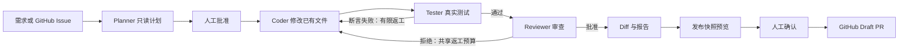

<div align="center">

# DevPilot

**面向真实代码仓库的智能研发协作平台**

把开发需求组织成可审批、可观察、可验证的 Agent 执行流程。

[](https://github.com/wzyn20051216/DevPilot/actions/workflows/ci.yml)


### [📚 开始学习 · 12 章工程实践](docs/learning/README.md)

[快速启动](#快速启动) · [用户说明书](docs/user-manual.md) · [部署指南](docs/deployment.md) · [开发指南](docs/development.md) · [实验结果](research/results/latest/README.md)

</div>


## 项目做什么

DevPilot 接收本地需求或 GitHub Issue，分析授权代码仓库并生成计划。用户批准后，Agent 通过受控工具阅读、修改和验证代码；结果以 Diff、机器测试、审查报告和持久化事件展示。发布前再生成快照预览，由用户确认创建 GitHub Draft PR。

当前工作台提供多角色执行，可选择启用或关闭混合检索；后端 API 与研究工具保留单 Agent 变体，用于独立对照。默认配置为 **SQLite + inline**，独立 Worker、MySQL 和 Redis 均按需启用。

## 一次任务如何完成


```mermaid
flowchart LR
    U[需求或 GitHub Issue] --> P[Planner 只读计划]
    P --> A[人工批准]
    A --> C[Coder 修改已有文件]
    C --> T[Tester 真实测试]
    T -->|通过| R[Reviewer 审查]
    T -->|断言失败：有限返工| C
    R -->|拒绝：共享返工预算| C
    R -->|批准| D[Diff 与报告]
    D --> V[发布快照预览]
    V --> H[人工确认]
    H --> G[GitHub Draft PR]
```

测试失败和审查拒绝共享默认 2 轮返工预算。新一轮修改后重新测试和审查；协议、工具执行或超时错误会明确报告。角色报告必须符合严格 JSON Schema，Tester 的通过结论以最后一次真实 `run_test` 为准。

## 已实现的能力

| 能力 | 实际行为 | 深入阅读 |
|---|---|---|
| 计划与人工审批 | 本地需求／Issue 导入，计划与执行分离，发布再次确认 | [任务流程](docs/learning/03-task-workflow.md) |
| 多角色协作 | Planner、Coder、Tester、Reviewer 串行交接、权限隔离、有界返工 | [协议与可靠性](docs/learning/06-protocol-and-reliability.md) |
| 代码检索与上下文 | AST／滑窗、384 维向量、BM25、加权 RRF、文件去重、程序压缩 | [RAG 与上下文](docs/learning/07-rag-and-context.md) |
| 受控工具与验证 | 目录授权、已有文件原子写入、命令白名单、Docker 禁网与资源限制 | [工具与沙箱](docs/learning/05-tools-and-sandbox.md) |
| 可靠任务执行 | 持久化事件、SSE 续传、取消、检查点、SQL／Redis 队列与租约校验 | [架构与存储](docs/learning/04-architecture.md) |
| 差异与发布 | Diff、真实测试／审查结果、快照一致性复核、远端 Draft PR | [用户说明书](docs/user-manual.md) |
| 独立评测 | 合成基线、检索查询、真实缺陷双校准和独立文件级裁判 | [评测与证据](docs/learning/08-evaluation.md) |

### 技术栈

| 层级 | 采用的技术 |
|---|---|
| 前端 | Vue 3、TypeScript、Pinia、Vite |
| API 与类型模型 | Python 3.12、FastAPI、Pydantic v2 |
| Agent Runtime | 自研 Tool Calling 循环、OpenAI 兼容模型 API、严格 JSON 角色协议 |
| 检索 | Python AST／窗口分块、all-MiniLM-L6-v2、NumPy、BM25、RRF |
| 工具协议 | Repository MCP 与 GitHub MCP |
| 状态与调度 | SQLite 默认，MySQL 可选；inline／SQL／Redis 执行方式 |
| 隔离执行 | Docker Sandbox：禁网、只读、512 MiB、1 CPU、128 进程上限 |
| 可观察执行 | SSE、事件序号、工具调用、用量与检查点记录 |

## 学习文档

[进入学习首页 →](docs/learning/README.md)

飞书技术知识库已整理为分章课程，包含 **12 个章节、10 张配图、源码链接、练习、参考答案和前后章导航**。可以直接在 GitHub 连续阅读。

| 学习路线 | 章节 | 适合目标 |
|---|---|---|
| 基础认识 | 01 项目概览 → 02 LLM 与 Tool Calling | 理解 Agent、State/Event、SSE 和 MCP |
| 工程执行 | 03 任务流程 → 04 架构 → 05 工具 → 06 协议 | 读懂审批、权限、隔离、队列和发布 |
| 检索与验证 | 07 RAG／上下文 → 08 独立评测 | 分清定位、压缩、验证和真实成绩 |
| 运行与复盘 | 09 部署 → 10 源码 → 11 边界／面试 → 12 实践 | 跑项目、做回归、用证据解释设计 |

课程正文依据项目实现编写，保留了[飞书知识库](https://dcn4btp2pzsc.feishu.cn/wiki/TLjZwYvmRivtOZk0nvkcuXEBnJg)中的已核对内容。分章阅读形式参考 Hello-Agents，内容围绕 DevPilot 的代码与实验展开。

## 快速启动

### Docker 启动

需要 Git 和使用 Linux 容器模式的 Docker Desktop。首次部署进入项目根目录，已有配置时保留原文件：

```powershell
git clone https://github.com/wzyn20051216/DevPilot.git
Set-Location DevPilot
Copy-Item .env.example .env
Copy-Item backend/.env.example backend/.env
```

配置两个文件：

| 文件 | 必填／应明确设置的内容 |
|---|---|
| 根 `.env` | `DEVPILOT_HOST_WORKSPACE_ROOT`：宿主机可操作仓库的父目录 |
| `backend/.env` | `LLM_API_KEY`、`LLM_BASE_URL`、`LLM_MODEL`：支持 Tool Calling 的模型 |
| `backend/.env` | `API_KEYS`：平台访问 Key；Compose 生产配置必填 |
| `backend/.env` | `ALLOWED_REPO_ROOTS=/workspace`：容器中的仓库目录边界 |

`LLM_API_KEY` 是后端调用模型的凭据，`API_KEYS` 是用户访问平台的凭据。宿主机目录映射到 `/workspace`，工作台填写容器路径，例如 `/workspace/my-repository`。

```powershell
docker compose build sandbox backend frontend
docker compose up -d backend frontend
docker compose ps
```

访问 **http://localhost:8080**，输入应用 API Key。需要 TypeScript／Java 沙箱时，再构建：

```powershell
docker compose build sandbox-polyglot
```

### 本地开发

需要 Python 3.12、uv、Node.js 22 与 Git。运行测试／命令工具还需要 Docker。

```powershell
uv sync --frozen
uv run uvicorn backend.src.main:app --reload
```

另开终端：

```powershell
Set-Location frontend
npm ci
npm run dev
```

通常访问 http://127.0.0.1:5173；若端口已占用，以 Vite 输出为准。API 文档位于 http://127.0.0.1:8000/docs。模型配置仍从 `backend/.env` 读取。

### 创建一个范围明确的任务

1. 输入授权范围内、真实存在的 Git 仓库路径。
2. 描述当前现象、目标行为、已有文件和相关测试。
3. 检查 Planner 的修改与验证计划，批准后执行。
4. 核对 Diff、测试命令与审查结果，再决定是否发布。

示例需求：

```text
修复分页接口在 page_size 为 0 时的错误处理。
目标：拒绝非正整数，正常分页保持原行为。
请先检查现有实现与测试，再修改已有文件并验证相关边界。
```

## 配置与维护

| 配置 | 作用 | 默认 |
|---|---|---|
| `DATABASE_BACKEND` | 业务历史、事件、检查点的状态库 | `sqlite` |
| `TASK_QUEUE_BACKEND` | 进程内执行、SQL 队列或 Redis 队列 | `inline` |
| `TASK_INLINE_MAX_RUNNING` | 单 API 进程并发容量 | `8` |
| `TASK_QUEUE_MAX_DEPTH` | queued 积压上限 | `100` |
| `TASK_WORKER_MAX_CONCURRENCY` | 单 Worker 并发容量 | `2` |
| `TASK_WORKER_LEASE_SECONDS` | 领取租约 | `300` 秒 |
| `TASK_WORKER_HEARTBEAT_SECONDS` | 心跳间隔 | `30` 秒 |
| `RAG_MODE` | 手动／single_* 启发式策略 | `manual` |

`TASK_QUEUE_BACKEND=sqlite` 是 SQL 实现的历史命名，也能跟随 MySQL 状态库。Redis 保存队列，业务历史继续写入所选状态库。切换前停止接收新任务并等待在途任务结束；已有数据不会自动迁移。

详见 [部署指南](docs/deployment.md)，包括独立 Worker、MySQL／Redis、路径映射、备份与迁移。

## 验证方式

先运行不调用付费模型的回归：

```powershell
uv sync --frozen --group research
uv run python -m pytest
Set-Location frontend
npm test
npm run build
npm audit
```

本次本机复核：**后端 242 passed、27 skipped；前端 8 项测试通过，类型检查与生产构建通过；npm audit 为 0 项已知报告漏洞**。跳过项需要专用 MySQL／Redis 测试连接，不能算作本机外部服务验收。

[GitHub CI](https://github.com/wzyn20051216/DevPilot/actions/workflows/ci.yml)配置临时 MySQL／Redis 服务，验证当前提交。业务运行代码、回归测试与研究工具分别管理，生产镜像排除测试及研究目录。

## 验证成果

### 真实缺陷：14 次独立验收通过，覆盖 8 个问题

在 SWE-bench Verified 来源的 **9 道有效 Issue、18 次重复验证**中，DevPilot 获得 **14 次文件级独立测试通过**。其中，**8/9 个问题至少一次通过独立测试，6/9 个问题两次均通过**；全部运行结果都保留在发布包中。

| 指标 | 结果 |
|---|---:|
| 问题覆盖：至少一次通过独立测试 | **8/9 · 88.9%** |
| 重复验证：两次均通过独立测试 | **6/9 · 66.7%** |
| 文件级独立测试通过 | **14/18 · 77.8%** |
| 工作流合规 | 11/18 · 61.1% |
| 流程完整成功 | 10/18 · 55.6% |

采用本项目独立文件级裁判，**不等同于官方 SWE-bench resolved**。流程完整成功是独立测试通过与工作流合规的交集。样本范围不足以支持总体修复率或多 Agent／RAG 优势结论。

工程实现另经 [269 项后端回归、8 项前端测试及生产构建](https://github.com/wzyn20051216/DevPilot/actions/runs/37413929595)验证，覆盖严格交接、任务调度、权限边界、取消恢复与前端接口等行为。真实修复数据属于 2026-10-05 冻结批次，工程回归属于后续代码版本，分别说明各自的验证范围。

### 检索与服务验证

- RAG 参数网格：720 组、32 条本项目标注查询，开发／验证各 16 条。
- 验证集选定配置：Recall@5 为 84.38%，MRR@5 为 0.6615；平均返回字符数较同批默认减少 47.65%，不是费用节省实测。
- 服务负载：3,312 次本机可控 HTTP 测量请求，描述服务执行链，不能换算为模型修复吞吐或生产 SLA。

逐次结果、参数与哈希见 [最终结果包](research/results/latest/README.md)。发布 JSON／CSV 使用 LF，方便跨平台校验；冻结的本机 `evidence/` 按既有规则留在本地，公开清单已标明其范围。

## 目录与文档

```text
backend/
  src/                 API、Agent、工具、检索、服务与状态库
  scripts/             历史重置和数据迁移
  docker/              隔离沙箱镜像
frontend/
  src/                 工作台、任务详情与客户端
  tests/               前端回归
tests/                后端回归与隔离进程验证
research/
  evals/               独立裁判与评测执行
  benchmarks/          合成 fixture 和标注
  scripts/             工程与参数评估
  results/latest/      冻结发布结果
docs/
  learning/            分章学习文档
  assets/learning/     10 张工程配图
  user-manual.md       使用说明
  deployment.md        部署维护
  development.md       开发验证
deploy/               可选部署示例
```

| 我想做什么 | 从这里开始 |
|---|---|
| 学习项目原理 | [课程目录](docs/learning/README.md) |
| 用工作台执行任务 | [用户说明书](docs/user-manual.md) |
| 配置数据库、队列或 Worker | [部署指南](docs/deployment.md) |
| 修改源码、运行测试 | [开发指南](docs/development.md) |
| 核对角色协议 | [多 Agent 交接规范](docs/multi-agent-protocol.md) |
| 查看原始统计与判分定义 | [最终研究结果](research/results/latest/README.md) |

## 当前边界

- 写入工具修改已有文本文件；新建文件和删除文件发布仍有限制。
- 浏览器重连不停止任务；检查点恢复会重新进入执行流程，不能承诺无损续跑或副作用恰好一次。
- fencing 在写入前校验所有权，检查与跨库写不是同一事务，不能抢占在途工具或回滚文件写入。
- API Key 是应用级访问凭据，用户身份、多租户、Redis Cluster／Sentinel 自动接管、真实多主机网络分区演练尚未完成。
- Compose 挂载 Docker socket 适合可信本地演示；公网生产隔离需要另外设计。

详细边界与后续验收方向见 [第 11 章](docs/learning/11-boundaries-and-interview.md)。

---

**[📚 从第一章开始学习 →](docs/learning/01-overview.md)**
