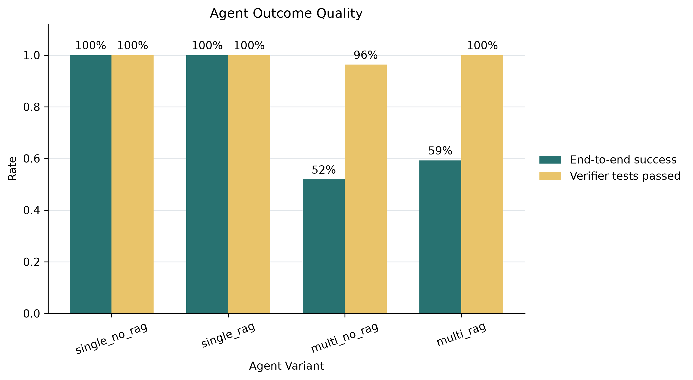
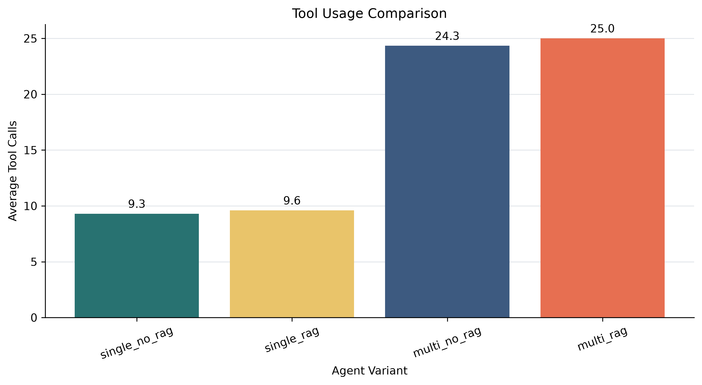
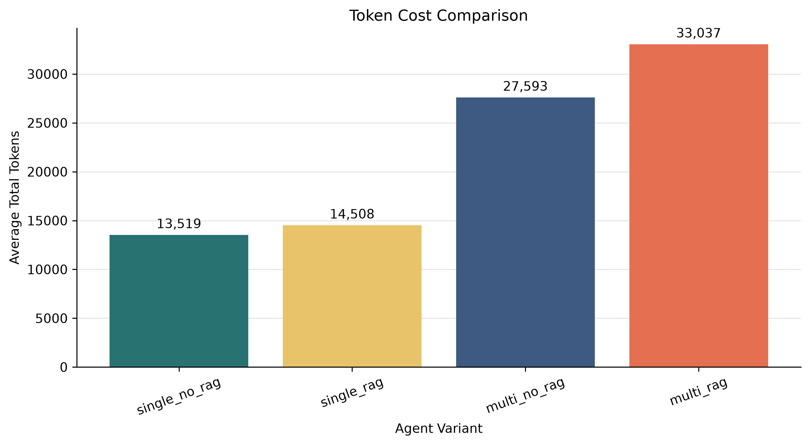
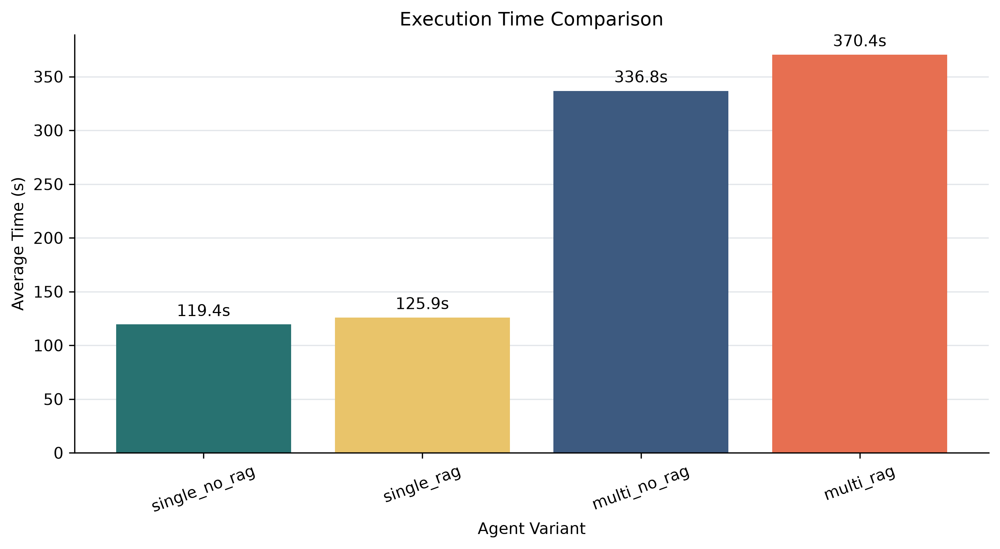

# DevPilot 正式 Benchmark 报告

## 实验摘要

| 项目 | 值 |
|---|---|
| 执行日期 | 2026-09-25 |
| Run ID | `68b84e0dd14f42afbe69788ed6260af3` |
| 设计 | 9 cases x 4 variants x 3 repeats |
| 有效记录 | 108 / 108 |
| 数据集 SHA-256 | `a7ab1c278d66c5f1d7dfba8df44426ca0f208827bf9545e1d41b957cf18a2254` |
| Total Tokens | 2,393,755 |
| 累计执行耗时 | 25,715.51 秒（约 7.14 小时） |

数据完整性检查通过：108 个 `(repeat, case, variant)` 键全部唯一，每轮 36 条，每个 case 12 条，每个 variant 27 条，无缺失或超出设计的记录。9/9 个错误基线均被独立 verifier 确认在 Agent 修改前测试失败。

## 总体结果

| Variant | 端到端成功率 | 测试通过率 | Tool Calls | 迭代 | 平均耗时 | 中位耗时 | P95 耗时 | 平均 Tokens |
|---|---:|---:|---:|---:|---:|---:|---:|---:|
| `single_no_rag` | 100.0% | 100.0% | 9.30 | 5.89 | 119.39 s | 107.34 s | 212.61 s | 13,519 |
| `single_rag` | 100.0% | 100.0% | 9.59 | 5.89 | 125.89 s | 105.04 s | 245.03 s | 14,508 |
| `multi_no_rag` | 51.9% | 96.3% | 24.33 | 15.56 | 336.77 s | 309.52 s | 647.88 s | 27,593 |
| `multi_rag` | 59.3% | 100.0% | 25.00 | 15.63 | 370.37 s | 319.09 s | 702.80 s | 33,037 |

## 配对消融结果

统计单位为 case：先对同一 case 的 3 次重复取平均，再对 9 个配对 case 计算 `B - A`。置信区间为 10,000 次 Bootstrap 的 95% CI，`p` 为 Wilcoxon signed-rank 检验。

| 对照（B - A） | 端到端成功率 | 耗时 | Tokens | 解读 |
|---|---:|---:|---:|---|
| `single_rag - single_no_rag` | +0.0 pp, CI [0.0, 0.0], p=1.000 | +6.50 s, CI [-5.12, 21.48], p=0.496 | +989, CI [-123, 2,049], p=0.164 | 未观察到 RAG 对单 Agent 的显著收益 |
| `multi_rag - multi_no_rag` | +7.4 pp, CI [-18.5, 37.0], p=0.906 | +33.61 s, CI [-1.16, 77.38], p=0.164 | +5,444, CI [1,840, 8,923], p=0.039 | RAG 的成功率增益不显著，Token 成本显著增加 |
| `multi_no_rag - single_no_rag` | -48.1 pp, CI [-70.4, -25.9], p=0.016 | +217.37 s, CI [184.93, 244.38], p=0.004 | +14,074, CI [10,956, 16,847], p=0.004 | 当前多 Agent 显著更慢、更贵，且编排成功率更低 |
| `multi_rag - single_rag` | -40.7 pp, CI [-55.6, -22.2], p=0.016 | +244.48 s, CI [209.67, 276.82], p=0.004 | +18,529, CI [16,137, 20,929], p=0.004 | 开启 RAG 后仍未抵消多 Agent 编排开销 |

## 可靠性发现

1. 单 Agent 的 54/54 次运行均正常收尾且通过独立测试，是当前默认执行路径。
2. 多 Agent 共有 24 次端到端失败，但其中 23 次的最终代码仍通过 verifier。主要原因是 Reviewer/Tester 结构化输出不符合 Schema、JSON 无效或 Agent 达到最大迭代后未正常收尾。
3. `multi_rag` 的测试通过率为 100%，但平均耗时为 `single_no_rag` 的 3.10 倍，平均 Token 为 2.44 倍。
4. RAG 没有减少总体工具调用；在这组微型 Python 任务上，建立索引和额外上下文的成本大于可观测收益。

## 结论与决策

本次实验不支持「对所有任务默认开启多 Agent + RAG」。当前建议是使用 `single_no_rag` 作为默认路径，仅当仓库规模、任务跨模块程度或上下文长度达到阈值时才启用 RAG。多 Agent 路径在投入默认使用前，应先修复结构化输出容错、阶段级重试和收尾状态判定。

## 边界

- 数据集只包含 9 个 Python 微型仓库，结论不能直接外推到大型多语言仓库。
- 每个 case 只重复 3 次；对于模型随机性，这足以展示趋势，但不是大样本性能基准。
- 耗时包含模型 API、Docker 验证和 RAG 模型初始化，因此代表端到端用户等待时间，不是纯 LLM 推理时间。
- Wilcoxon 检验只有 9 个配对 case，应结合效应量和置信区间解读，不应只看 p 值。

## 可复现资产

- 逐次数据：[`formal_benchmark_2026-09-25.csv`](formal_benchmark_2026-09-25.csv)
- 实验配置：`backend/data/experiments/68b84e0dd14f42afbe69788ed6260af3/config.json`
- 数据集审计：`backend/benchmarks/audit_report.json`
- 运行与统计方法：[`../EXPERIMENTS.md`](../EXPERIMENTS.md)
