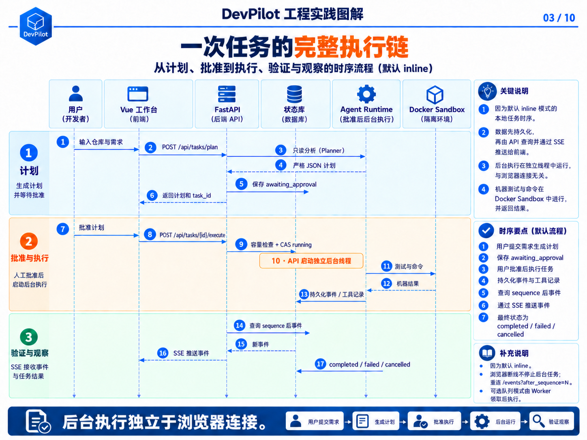
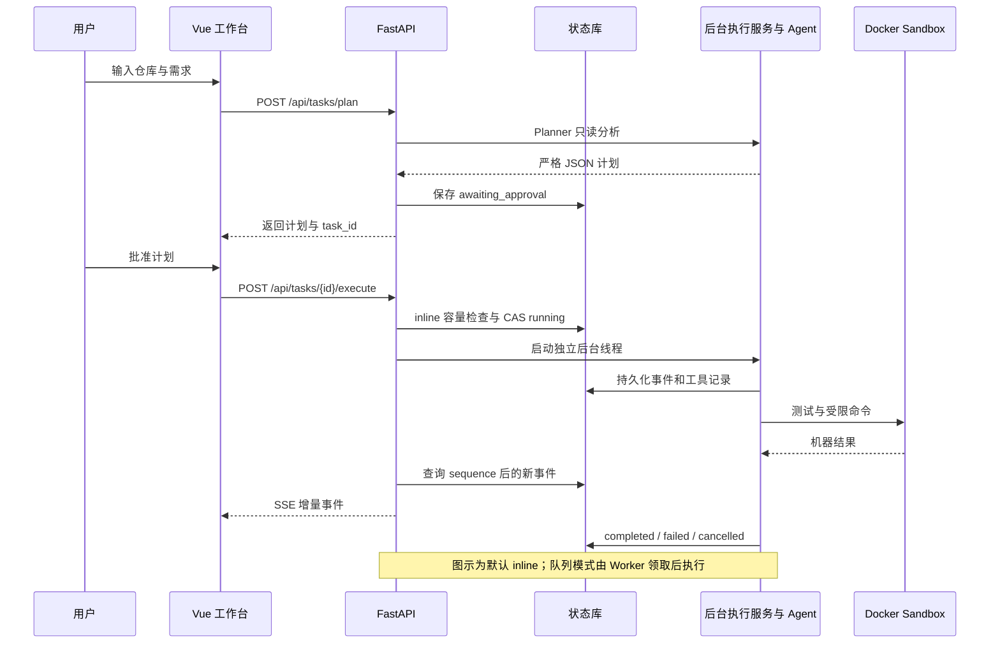

# 第03章 · 任务流程：审批、取消与恢复

[← 第02章](02-agent-foundations.md) · [课程目录](README.md) · [第04章 →](04-architecture.md)

> 本章目标：从概念读到实现。下列终端命令默认在仓库根目录执行。

## 学习目标

- 理解plan与execute分离。
- 区分inline执行、队列入队和Worker领取。
- 区分浏览器重连、任务恢复和自动重试。

---

## 3.1 本地任务主流程（一张图看懂）

图 3｜默认 inline 任务时序：计划、审批、后台执行与持久化 SSE





关键点逐条解释：

1. Plan 与 Execute 分离：生成计划不修改任何代码，用户先看清要做什么，再决定是否执行。

1. inline 的 /execute 在本进程锁内检查容量，再用带旧状态条件的 SQL UPDATE 领取；并发审批仅一个成功。队列模式先幂等入队，Worker 再 CAS 为 running，不能把入队等同于已经运行。

1. 后台线程 + 事件先落库：前端只是「事件的消费者」，不是「任务的持有者」。

1. 完成后不自动发布：发布需要第二个审批点。

## 3.2 多 Agent 流程

```text
Planner 输出计划
  ↓
Coder 修改代码并查看 Git Diff
  ↓
Tester 运行真实测试
  ├─ 失败：把 stdout/stderr 交还 Coder，最多返工 2 轮
  └─ 通过：进入 Reviewer
  ↓
Reviewer 独立检查需求、边界和非必要修改
  ├─ approved = true：完成
  └─ approved = false：交还 Coder 返工（与测试失败共享同一返工预算）
```

返工规则（max_repair_rounds 默认 2）：

- 测试失败与审查拒绝共享同一返工预算，因此不会「测试返工 2 次 + 审查返工 2 次」无限循环。

- 返工交接携带原始需求、已批准计划及本轮失败报告，回到 Coder，再执行 Tester 和 Reviewer；不会重新调用 Planner，也不会重新生成审批计划。

- 每次 Coder 执行后重新验证，不复用旧的测试通过或审查批准。

Planner、Coder、Tester、Reviewer 均使用严格协议模型，只接受一个 JSON 对象，拒绝围栏、前后解释、未知／缺失字段和类型转换。失败后最多进行一次禁止工具的格式纠正；仍不合法则 protocol_error，停止交接。测试工具、收集或超时错误属于 test_execution_error，停止验证；普通断言失败才进入有界返工。

## 3.3 GitHub Issue 流程

1. 用户填写 owner、repo、Issue 编号和本地仓库路径。

1. GitHub MCP 读取 Issue 标题、正文和元数据。

1. 系统把 Issue 转换为完整开发请求。

1. Planner 生成计划并保存任务来源。

1. 后续执行流程与本地任务一致。

1. 完成后生成只读 PR Preview。

1. 用户二次审批后创建分支、提交文件并发布 Draft PR。

## 3.4 取消、断线与恢复

- 取消：状态先变 cancelling，后台设置 threading.Event；Agent 在每轮模型调用和工具调用边界检查，随后写入 cancelled

- 断线续传：前端记录最后事件序号，重连 /events?after_sequence=N

- 进程重启：仅 inline 模式启动时把遗留 running/cancelling 标记为 interrupted；队列模式 API 重启不影响独立 Worker 的任务

- SQL／Redis 队列的过期租约都隔离为 dead，业务任务标记 interrupted；不直接自动接管仍可能执行副作用的旧任务。确认旧 Worker／工具停止后，用户显式 /resume。

- 恢复：用户显式调用 /resume，系统从已批准的计划重新执行

⚠️ 诚实的边界：execute_stream 仍从编排入口运行，阶段、返工计数与工具副作用没有事务恢复。检查点会校验调用配对、保留系统和原始任务，但不能描述为「无损续跑」——已经发生的文件写入无法回滚。

## 源码导航

- [main.py](../../backend/src/main.py)
- [task_execution_service.py](../../backend/src/services/task_execution_service.py)
- [stream.ts](../../frontend/src/api/stream.ts)

## 动手与自检

1. 比较/execute与/events：谁修改状态，谁只读取事件？
2. 解释为什么队列中的任务可能仍是awaiting_approval。
3. 运行uv run python -m pytest tests/backend/unit/test_task_execution.py tests/backend/unit/test_context_resume.py。

<details>
<summary>展开参考答案</summary>

inline执行会原子领取状态；队列模式先入队，Worker领取时才变running。SSE只读取已持久化事件。恢复从已批准计划和可用检查点重新进入流程，不保证副作用恰好一次。

</details>

---

[← 第02章](02-agent-foundations.md) · [返回目录](README.md) · [第04章 →](04-architecture.md)
