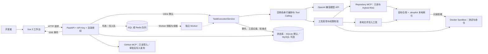
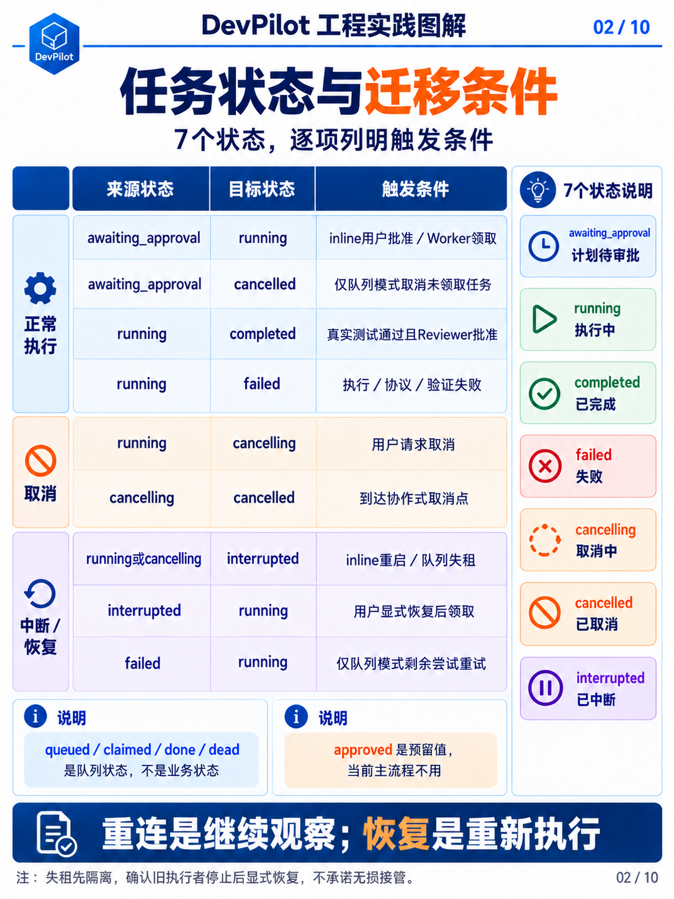
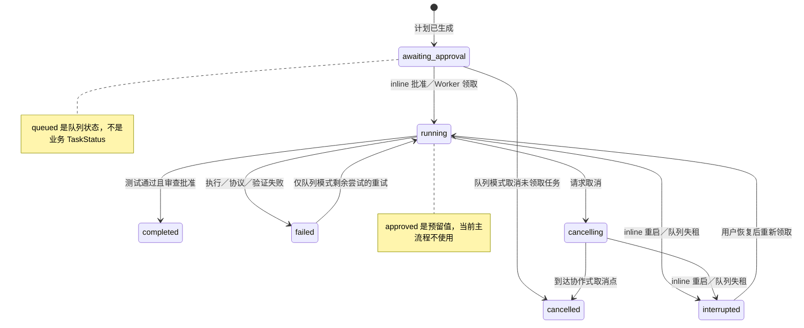

# 第04章 · 系统架构、状态机与存储

[← 第03章](03-task-workflow.md) · [课程目录](README.md) · [第05章 →](05-tools-and-sandbox.md)

> 本章目标：从概念读到实现。下列终端命令默认在仓库根目录执行。

## 学习目标

- 辨认API、执行服务、Agent和工具层的真实依赖。
- 掌握七种业务状态与队列状态的差别。
- 理解SQLite/MySQL状态库与SQL/Redis队列的组合。

---

## 4.1 总体架构

图 1｜总体架构：四角色串行、默认 inline 与可选 Worker 路径

与初版的区别（这几块是新增的）：

- API Key 鉴权层：所有业务请求先过 require_api_key。

- 任务队列：inline 时是进程内线程，sqlite/redis 时是持久化队列 + 独立 Worker。

- fencing 校验：执行服务写事件/状态前校验「本执行者是否仍是任务的合法持有者」。

- 双后端状态库：SQLite 或 MySQL，由统一方言适配层屏蔽差异。

## 4.2 分层职责

- API 层（main.py、schemas.py）：鉴权、参数校验、路由与 SSE 转发。当前部分路由直接调用 git_diff、仓库分析和发布收集工具；这是现有实现，不应描述为已完全隔离所有仓库操作。

- 服务层（services/）：任务执行、队列、发布、上下文（不做什么：不包含模型提示词逻辑）

- Agent 层（agents/）：Tool Calling 循环、角色、编排（不做什么：不绕过工具直接动文件）

- 工具层（tools/、mcp_*）：实际执行动作，实施边界（不做什么：不做业务决策）

- 数据层（database/）：状态库读写、方言适配（不做什么：不包含业务规则）

分层帮助集中管理职责和替换实现，例如 Agent 不直接处理 SQLite／MySQL 方言。但实际依赖并非严格只向下一层：工具调用 MCP 客户端，服务调用 Agent，API 也有直接工具调用；描述现有边界比宣称理想架构更准确。

## 4.3 任务状态机

图 2｜任务状态机：七种状态与逐项迁移条件

关键状态迁移使用 compare-and-set（带旧状态条件的 SQL Update）。这样并发请求中只有一个能成功迁移状态，天然防重。

## 4.4 数据模型

状态库共 9 张表，职责如下：

- tasks：任务主体：仓库路径、需求、状态、执行模式

- plan_steps：Planner 生成并等待审批的计划；批准后使用同一份计划执行，不是只保存审批通过的步骤。

- agent_events：全量事件流（含递增 sequence），SSE 的数据源

- tool_calls：工具调用的参数、结果预览、耗时、成败

- task_sources：任务来源（本地 / GitHub Issue）

- publish_previews：PR 预览、快照 Hash、发布状态

- evaluation_results：历史评测记录表。当前结果 API 读取 backend/src/assets/evaluation/latest.json 发布快照，不把业务库中的旧记录自动合并为新实验。

- task_queue：队列任务（含 fence_token、租约、尝试次数）

- agent_contexts：上下文检查点，用于中断恢复

SQLite 连接开启外键和 WAL，以改善单机读写并发；这些 PRAGMA 不适用于 MySQL。SQL 队列领取时，SQLite 用 BEGIN IMMEDIATE 写事务，MySQL 用 FOR UPDATE SKIP LOCKED；WAL 本身不能代替领取、租约与重试机制。

## 源码导航

- [task.py](../../backend/src/models/task.py)
- [connection.py](../../backend/src/database/connection.py)
- [task_queue.py](../../backend/src/services/task_queue.py)

## 动手与自检

1. 在状态表中定位用户恢复和队列重试的不同条件。
2. 回答mysql+sqlite队列模式中task_queue实际写到哪里。
3. 运行uv run python -m pytest tests/backend/unit/test_task_queue.py。

展开参考答案

TASK_QUEUE_BACKEND=sqlite是SQL实现的历史命名，底层跟随状态库，所以mysql+sqlite写MySQL task_queue。queued/claimed/done/dead是队列状态，不是业务TaskStatus。

---

[← 第03章](03-task-workflow.md) · [返回目录](README.md) · [第05章 →](05-tools-and-sandbox.md)
