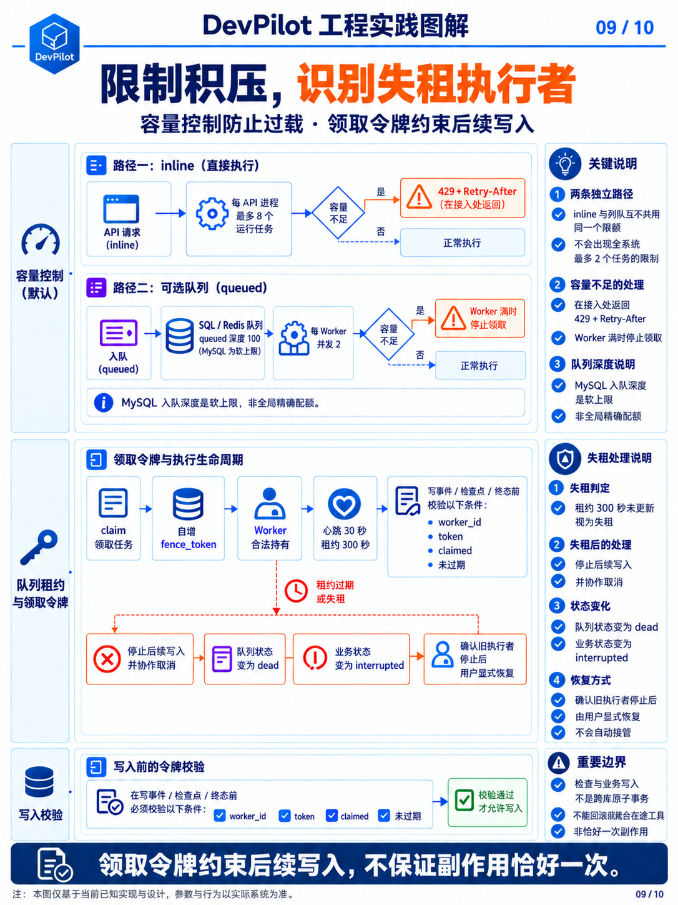

# 第06章 · 严格交接、可靠执行与发布

[← 第05章](05-tools-and-sandbox.md) · [课程目录](README.md) · [第07章 →](07-rag-and-context.md)

> 本章目标：从概念读到实现。下列终端命令默认在仓库根目录执行。

## 学习目标

- 掌握四角色必填字段及严格JSON交接。
- 理解机器测试事实、有界返工和fencing。
- 理解发布快照的复核与多步远端发布边界。

---

## 6.1 结构化输出（让模型「说人话」变成「说机器话」）

四个角色的必填输出：Planner={summary, steps[{id,title,description}]}；Coder={status,summary,modified_files,changes,risks}；Tester={passed,summary,stdout,stderr}；Reviewer={approved,summary,issues}。分别由四个 ProtocolOutput 模型严格校验，不能互相代替。AgentHandoff 携带 protocol_version、source、target、phase、task、plan、coder_report、test_report、review_report、repair_round，由编排器生成并验证交接顺序。以下是当前角色协议的处理：

- parse_protocol_output 直接严格解析唯一 JSON 对象，不从 Markdown 围栏或混合文本提取；宽容 parse_structured_output 仍在兼容路径使用，不是新角色协议的放行规则。

- 字段或格式无效时，最多发起一次 tool_choice=none 的纠正请求；禁止调用新工具、修改代码，禁止把 blocked／拒绝改成 implemented／批准，也不能删除原审查问题。

- 最终用 Pydantic 严格校验字段和类型。

- 拒绝未知字段和隐式类型转换（如字符串 "true" 冒充布尔 true）。

协议还内建了语义一致性校验（这是最巧妙的部分）：

- Coder：status = blocked 时必须在 risks 中说明阻塞原因，不能空报告跳过

- Reviewer：approved = true 时 issues 必须为空；拒绝时必须列出具体问题

- Planner：计划步骤 id 必须唯一且为正整数

Tester 结论以最后一次真实 run_test 为准：模型自报 passed=true 不能覆盖机器失败；后一次测试超时或异常会使早先通过证据失效。Coder 的 modified_files 必须匹配本轮真实写入记录。协议严格合法只证明能交接，不证明业务修复正确。

## 6.2 后台执行与 Trace

图 9｜背压与 fencing：容量、租约校验、失租隔离及副作用边界

TaskExecutionService 维护当前进程内的后台线程与取消事件；inline 运行在 API 进程，可选队列模式运行在 Worker 进程。事件先持久化，SSE 再查询。tool_result 同时写入 tool_calls 的参数、结果预览、耗时和成败，可计算以下指标；Trace 不是所有 stdout／文件内容的无限量完整存档。

- 总事件数和 Tool Call 数。

- 失败工具数。

- 总 Token 与估算成本。

- LLM 耗时和工具耗时。

- 每个 Agent 的调用分布。

- RAG 调用次数和检索耗时。

队列模式的 fencing 校验检查 worker_id、fence_token、claimed 状态和未过期租约；在事件／检查点／终态写入前检查，失租后停止后续写入并协作式取消。过期任务先隔离，不在仍有副作用的情况下直接交给新 Worker。inline 没有队列租约。

fencing 是写入前的应用层检查，检查与业务写入并非跨 SQL／Redis 的同一事务；仍存在检查后失租的竞态窗口。它也不能抢占在途模型／工具调用或回滚文件写入，因此不能承诺副作用恰好一次。不同任务同时操作同一仓库仍需独立工作区或额外串行化。

## 6.3 发布一致性（TOCTOU 防护）

Preview 收集相对 HEAD 的新增／修改及未跟踪文件，过滤敏感路径，保存文件内容快照、Hash、分支与 PR 文案。确认发布时复核仓库、Git 基线、工作区及快照，变化时要求重新预览。GitHub MCP 依次创建远端分支、提交快照文件、创建 Draft PR；不在用户本地仓库自动提交。删除文件当前被拦截，多步远端发布也不是一个原子事务。

💡 这对应安全系统中的 TOCTOU 防护：检查时的内容必须与使用时的内容一致。用户批准的是「这一份代码」，不是「这个分支名」。

## 源码导航

- [agent_protocol.py](../../backend/src/models/agent_protocol.py)
- [orchestrator.py](../../backend/src/agents/orchestrator.py)
- [task_execution_service.py](../../backend/src/services/task_execution_service.py)
- [publish_service.py](../../backend/src/services/publish_service.py)

## 动手与自检

1. 解释格式纠正为什么不能把审查拒绝改成批准。
2. 说明失租后的工具副作用为什么不能被事务回滚。
3. 运行uv run python -m pytest tests/backend/unit/test_multi_agent_protocol.py tests/backend/unit/test_reliability.py。

展开参考答案

格式纠正只修表达，不改变语义结论。测试失败与审查拒绝共享2轮预算。fencing在写入前检查所有权，但检查与跨库写不是同一事务，也不能回滚已发出的文件写入。

---

[← 第05章](05-tools-and-sandbox.md) · [返回目录](README.md) · [第07章 →](07-rag-and-context.md)
