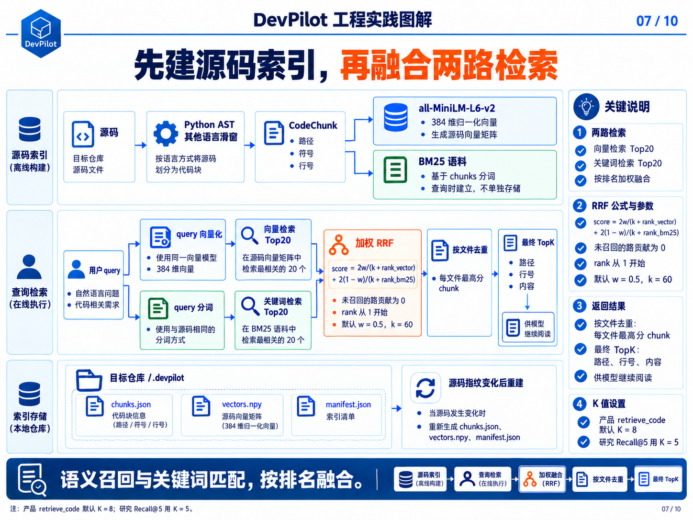
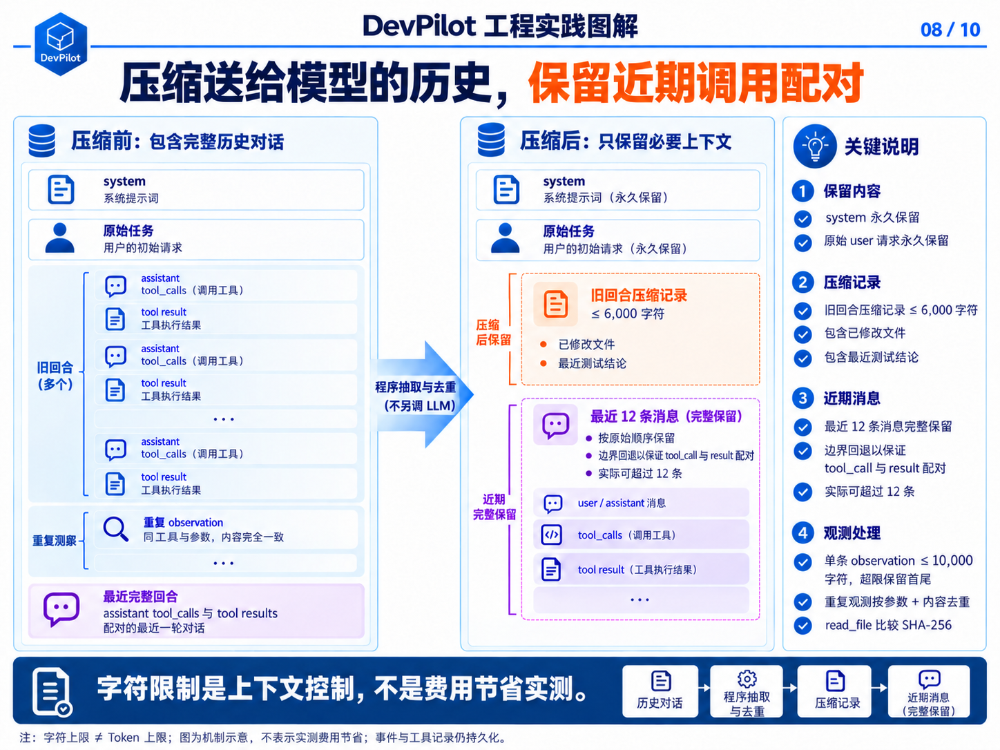

# 第07章 · Hybrid Code RAG与上下文工程

[← 第06章](06-protocol-and-reliability.md) · [课程目录](README.md) · [第08章 →](08-evaluation.md)

> 本章目标：从概念读到实现。下列终端命令默认在仓库根目录执行。

## 学习目标

- 区分索引构建与在线查询的数据流。
- 掌握加权RRF、文件去重和产品/实验参数。
- 掌握程序压缩、精确去重与调用配对边界。

---

## 7.1 Hybrid Code RAG（混合代码检索）

图 7｜Hybrid Code RAG：源码索引、两路召回、加权 RRF 与文件去重



普通 RAG 面向自然语言文档，Code RAG 还要保留文件、符号和行号信息。DevPilot 的索引流程是：

```text
源码文件
  → 按 AST 或滑动窗口分块
  → 生成带文件名和符号名的 embedding_text
  → all-MiniLM-L6-v2 生成 384 维归一化向量
  → 同时建立 BM25 语料
```

产品默认查询分别取向量 Top 20 与 BM25 Top 20，再按 chunk 融合。参数为 candidate_k=20、rrf_k=60、vector_weight=0.5；排名从 1 开始。MCP retrieve_code 默认最终 top_k=8，研究中的 Recall@5 使用 top_k=5，两者不能混同。

```text
score(d) = 2w / (k + rank_vector(d))
         + 2(1-w) / (k + rank_bm25(d))

某一路未召回该 chunk 时，该路贡献为 0。
默认 w=0.5、k=60，等价于两路各加 1/(60+rank)。
```

按融合分数降序后，每个文件只保留最高分 chunk，再截取最终 top_k。返回文件路径、符号、起止行号、分数和源码片段，模型可继续 read_file 阅读原文。索引保存在目标仓库的 .devpilot/（chunks.json、vectors.npy、manifest.json）；加载时校验源码指纹，源码变化后重建，不是向量数据库服务。

为什么要混合检索？

- 向量检索：语义相近但词面不同的查询（如「处理超时」→「timeout handling」）

- BM25：函数名、配置项、异常名等精确词匹配

- RRF 融合：只依赖排名而非原始分数，避免两套分数尺度不一致

## 7.2 为什么检索指标高，修复率仍可能下降

这是本项目最反直觉、也最值得讲的发现：

检索系统回答的是「相关文件能否被找到」； Agent 任务回答的是「模型能否基于证据完成正确修改」。 两者之间还隔着理解、工具选择、运行时验证和兼容性推断。

检索指标与修复指标不能互相替代。当前发布包报告了本项目查询集的检索表现，以及一个真实缺陷批次；没有同题、同预算的 RAG 开／关冻结对照，因此不能从这批数据判断 RAG 是否提高或降低修复率。以下是需要用实验验证的可能原因：

- 额外上下文会形成错误锚点，把模型引到不相关的方向。

- 检索结果可能相关，却不是决定行为的运行时证据。

- 小仓库本来就能通过 list_files + search_code + read_file 快速定位。

- RAG 增加索引和推理延迟。

结论：RAG 应当是可评测、可关闭、可按仓库规模启用的能力——而不是「有就一定开」。

## 7.3 上下文压缩

图 8｜上下文压缩：程序摘要、精确观测去重与工具回合配对



Tool Calling 长任务会重复携带历史消息，输入 Token 往往呈近似二次增长——对话越长，每一轮都在重发全部历史。DevPilot 的确定性压缩策略是：

- 永久保留 system message 和用户原始 Issue。

- 默认保留最近 12 条消息；若边界落在 tool result 中，向前回退到对应 assistant tool_calls，因此实际保留条数可能超过 12。

- 用程序抽取更早回合中的工具名、参数片段和输出片段，形成最多 6,000 字符的压缩记录；不是另调 LLM 生成摘要。

- 保留已修改文件和最近测试结论。

- 裁剪点回退到 assistant tool call 边界，避免出现「孤立的 tool result」（有结果没调用，模型会困惑）。

- 单次工具 observation 最多进入上下文 10,000 字符。

压缩仅改变下一轮发给模型的上下文；执行轨迹仍保留事件与工具结果预览。重复观测按工具名、规范化参数及内容去重，read_file 额外比较内容 SHA-256。单条 observation 超限时保留首尾；这些字符上限不是 Token 上限，也不能直接换算费用。

## 7.4 RAG 检索评测

参数网格：720 组配置、32 条人工查询；开发集选参、验证集报告（避免在验证集上过拟合）。

16 条验证查询的选定配置：Recall@5=84.38%、MRR@5=0.6615、平均返回 11,646.75 字符；同批默认为 68.75%、0.4604、22,247.4375 字符，字符数减少 47.65%。选定参数为 window80_no_overlap、top_k=5、candidate_k=20、rrf_k=10、vector_weight=0.5；产品源码默认仍为 AST／窗口兜底、80/15、rrf_k=60，没有自动改成选定配置。开发与验证的目标文件有重合，指标只描述本项目标注查询，字符减少不是生产费用节省。

Embedding 首次缺缓存时会下载模型，已缓存时优先 local_files_only 加载；backend／worker 共享独立模型缓存卷。发布包的网格计算缓存查询向量和每路候选，独立查询耗时包含编码与 BM25 构建、不含索引构建；不能把网格耗时当成线上逐次查询延迟。

## 源码导航

- [chunker.py](../../backend/src/rag/chunker.py)
- [code_index.py](../../backend/src/rag/code_index.py)
- [embedder.py](../../backend/src/rag/embedder.py)
- [base_tool_agent.py](../../backend/src/agents/base_tool_agent.py)

## 动手与自检

1. 解释query为何不能生成BM25源码语料。
2. 列出产品默认参数和验证选定参数的差异。
3. 运行uv run python -m pytest tests/backend/unit/test_rag_index.py tests/backend/unit/test_rag_policy.py tests/backend/unit/test_embedding_cache.py。

<details>
<summary>展开参考答案</summary>

源码构建CodeChunk与向量，BM25语料由chunks生成。默认每路20候选、RRF k=60、w=0.5，MCP最终K=8；报告Recall@5用K=5，选定k=10不自动覆盖产品默认。压缩是程序抽取，不是另调LLM。

</details>

---

[← 第06章](06-protocol-and-reliability.md) · [返回目录](README.md) · [第08章 →](08-evaluation.md)
