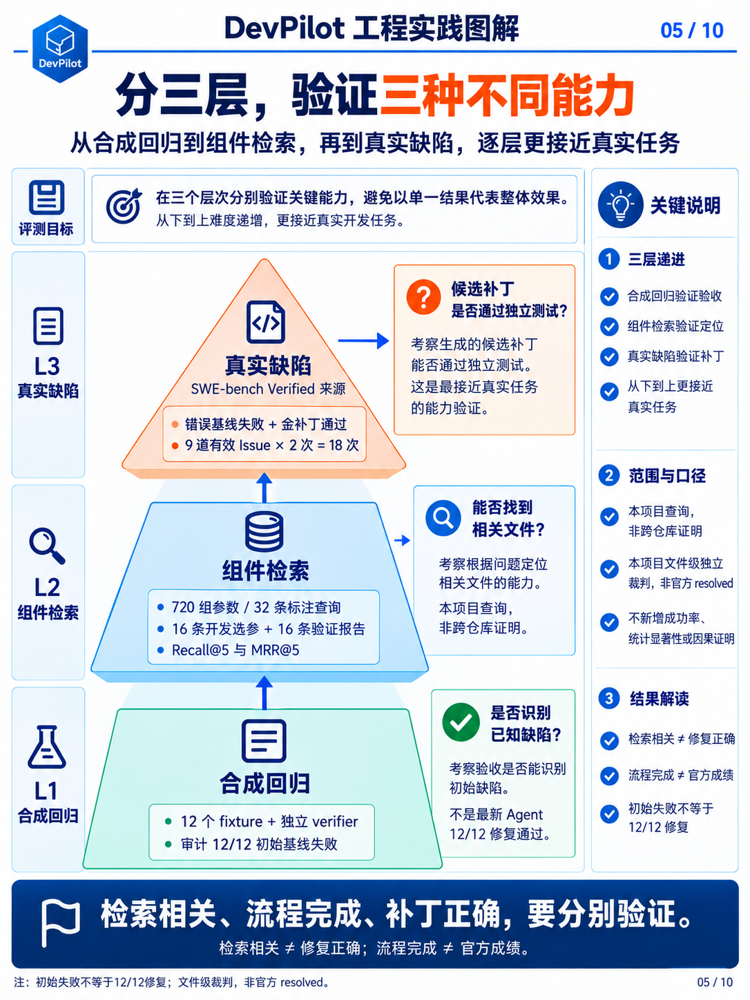
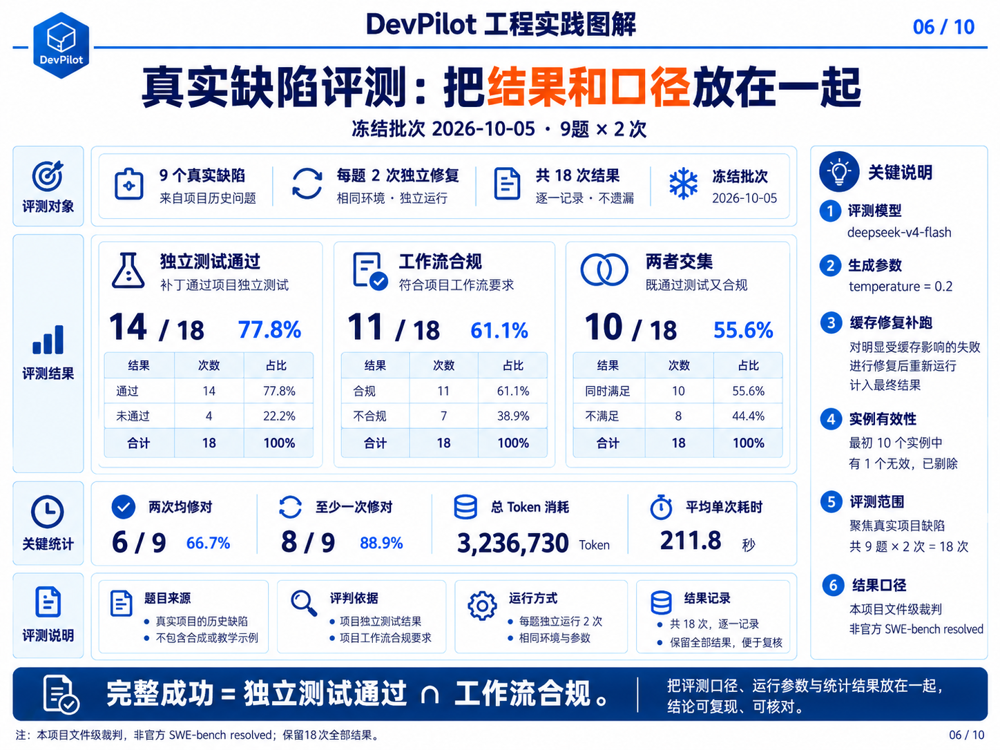

# 第08章 · 独立评测与真实缺陷证据

[← 第07章](07-rag-and-context.md) · [课程目录](README.md) · [第09章 →](09-run-and-deploy.md)

> 本章目标：从概念读到实现。下列终端命令默认在仓库根目录执行。

## 学习目标

- 区分合成基线、组件检索与真实修复。
- 理解基线/金补丁双校准和测试保护。
- 正确解释14/18、11/18和10/18。

---

这一章回答一个问题：你怎么知道这东西真的有用？ 答案是：不靠感觉，靠可复现的分层评测。

## 8.1 独立 Verifier（独立裁决器）

Agent 说「测试通过」不等于代码正确。 DevPilot 把验证分成两层：

- 运行流程中的 Tester：为 Agent 提供反馈，帮助它在任务过程中自我修正。

- 评测器（独立 Verifier）：在 Agent 结束后，从受保护的验证目标重新运行测试——它不看 Agent 说了什么，只看真实结果。

真实缺陷评测还会排除候选补丁对测试文件和测试配置的修改，防止 Agent 通过删除断言来「修复」任务。

测试是验收标准。若候选补丁能同时修改标准，测试通过就可能失去意义，因此研究评测保护测试文件及测试配置，并在 Agent 结束后独立复验；这是一项风险控制，不代表所有 Agent 必然篡改测试。

---

## 8.2 为什么需要三层评测

图 5｜三层评测：合成基线、组件检索与真实缺陷分别验收

只做组件评测，会把「找得到文件」误当成「修得好代码」；只展示 Demo，又无法知道失败率。因此 DevPilot 用三层：

- 合成回归：我的改动有没有破坏已知能力？（手段：12 个自建 fixture + 独立 verifier）

- 组件评测：RAG 检索准不准？（手段：标注查询 + Recall@K / MRR）

- 真实缺陷：能不能修真实仓库的 Bug？（手段：SWE-bench Verified + 双校准门禁）

## 8.3 四种架构变量（对照实验的基石）

- single_no_rag：单 Agent，不用检索

- single_rag：单 Agent，用混合检索

- multi_no_rag：多 Agent，不用检索

- multi_rag：多 Agent，用混合检索（当前默认）

每次运行都会记录：成功与否、测试结果、工具调用、迭代次数、返工次数、耗时、Token、LLM/工具耗时、工作区和错误信息——这样才能做同题配对对比，而不是「跑一次感觉不错」。

💡 注意：前端只暴露 multi_rag 与 multi_no_rag 两个选项（默认 multi_rag）。single_* 变体是研究用的实验开关，不面向最终用户。

## 8.4 合成回归（测「有没有退化」）

数据集共 12 个 fixture：9 个基础 Python 用例（easy／medium／hard 各 3 个），另有 TypeScript、Java、Python 跨模块各 1 个；全部难度分布为 easy 3、medium 5、hard 4。audit_report.json 记录 12/12 未修复基线失败，只证明 verifier 能识别初始缺陷，不代表最新 Agent 已完成 12/12 修复。

💡 为什么初始必须失败？ 如果一个任务在没修的时候测试就通过，那它根本证明不了 Anything。这叫「校准门禁」，是评测的第一道防线。

合成回归用于检测已知能力是否退化；需要真实运行候选 Agent 并检查独立 verifier 后才能声明修复通过。当前保留的审计是初始基线结果，不能替代候选运行，也不能代表真实仓库总体性能。

## 8.5 SWE-bench 真实缺陷评测

图 6｜冻结真实缺陷结果：14/18 独立测试通过，10/18 流程完整成功

每题固定官方 base commit 与镜像，先验证错误基线失败、金补丁通过，再运行 Agent；裁判使用本项目映射的文件级测试，候选测试／测试配置改动被保护和排除。最初 10 个实例中 matplotlib__matplotlib-20676 未通过环境校准、没有模型运行，最终统计 9 个有效实例 × 2 次；无效实例保留在报告中。

最终冻结批次由 adaptive_multi_20261005 及其缓存修复补跑组成，使用 deepseek-v4-flash、temperature=0.2。以下 18 次统计全部保留，不是只挑通过结果；当前严格角色协议修改后的 smoke 不能冒充这一批次的成绩。

- 有效 Issue 数量：9 道

- 每题重复次数：2 次

- 完整模型运行：18 次

- 文件级独立测试通过：14/18（77.8%）

- 工作流合规：11/18（61.1%）

- 流程完整成功：10/18（55.6%）

- 两次都修对的题：6/9

- 至少一次修对的题：8/9

- 累计模型 Token：3,236,730

- 平均 Agent 耗时：211.8 秒

这是本项目独立文件级裁判口径，不等同于官方 SWE-bench resolved。正确修复=独立测试通过；工作流合规=满足本项目的必需工具门禁且没有流程错误；流程完整成功=正确修复且工作流合规。因此是 14 次修对、11 次合规、两者交集 10 次，不能把三项比例相加或互换。

## 8.6 失败样本为什么有价值

失败比成功更能说明问题。历史诊断中发现：

- 模型会用不同作用域的对象替代 Issue 原始复现（改了「看起来像」的东西）。

- 模型会误判生成器异常的边界（把环境错误当成代码错误）。

这类失败直接指向「运行时探针」和「协议兼容检查」的能力缺口——比一个漂亮的成功案例更有信息量。

💡 有的失败还暴露了评测环境本身的问题（工作区不完整造成假阴性）。修好环境后，同一个候选补丁能通过——所以评测基础设施本身也要被验证。

## 8.7 如何正确表达实验结论

可以说：

- 「合成审计确认 12/12 未修复基线失败；候选修复成绩需另附实际运行报告。」

- 「文件级 RAG 在 16 条验证查询上 Recall@5 为 84.38%。」

- 「9 道真实 Issue 各重复 2 次，文件级独立测试通过 14/18。」

不应说：

- ❌「DevPilot 修复真实 Bug 的成功率是 78%。」（样本太少，且是自研口径）

- ❌「RAG 已经显著提升代码修复效果。」（实验没有支持这个结论）

- ❌「多 Agent 一定比单 Agent 可靠。」（不同任务类型结论不同）

💡 为什么这么严格？ 因为样本量、重复次数和仓库类型都不足以支持泛化。一个诚实的 60% 比一个注水的 90% 更有价值——后者在面试中被追问一句「样本多大」就崩了。

## 源码导航

- [audit.py](../../research/evals/audit.py)
- [real_world.py](../../research/evals/real_world.py)
- [metrics.py](../../research/evals/metrics.py)
- [README.md](../../research/results/latest/README.md)

## 动手与自检

1. 说明12/12初始失败能证明什么、不能证明什么。
2. 从发布结果中找出环境校准无效的实例。
3. 运行uv run python -m pytest tests/backend/unit/test_real_world_calibration.py tests/backend/unit/test_pytest_output.py。

展开参考答案

合成基线失败只证明verifier能识别初始缺陷。原始10实例有1题校准无效，最终9题×2次。14次独立测试通过，11次工作流合规，交集10次；不是官方SWE-bench resolved。

---

[← 第07章](07-rag-and-context.md) · [返回目录](README.md) · [第09章 →](09-run-and-deploy.md)
