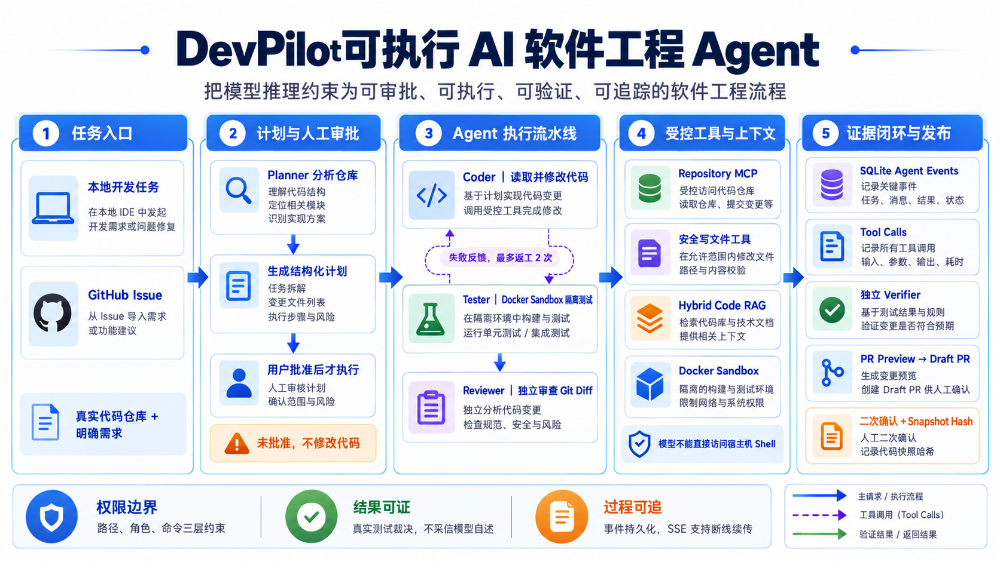
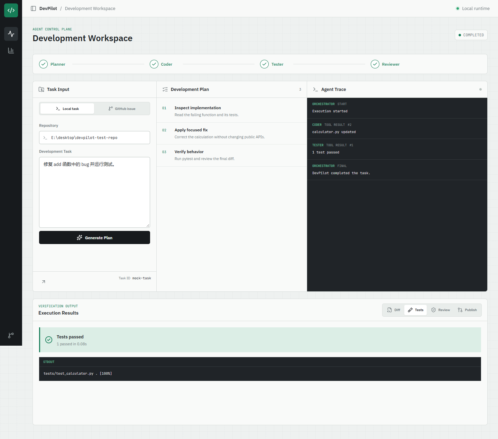
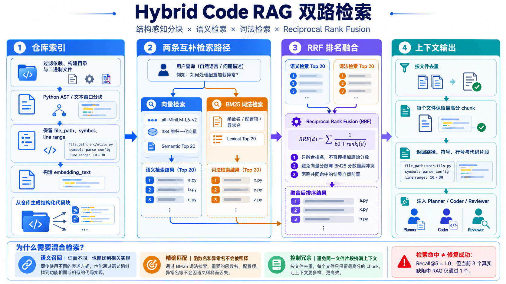
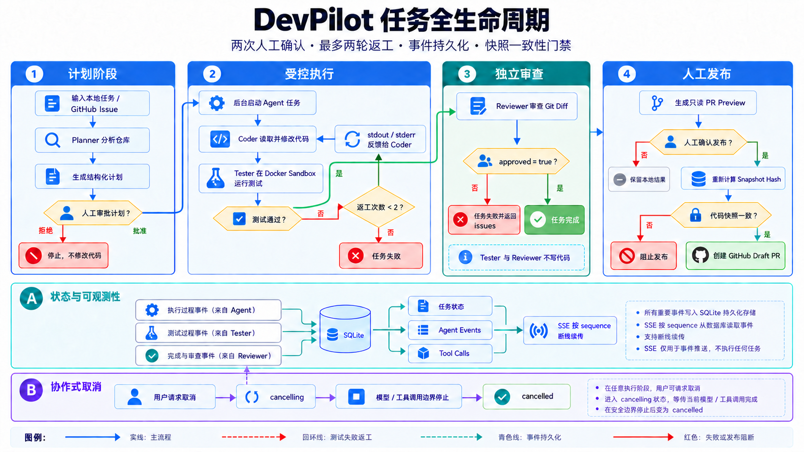
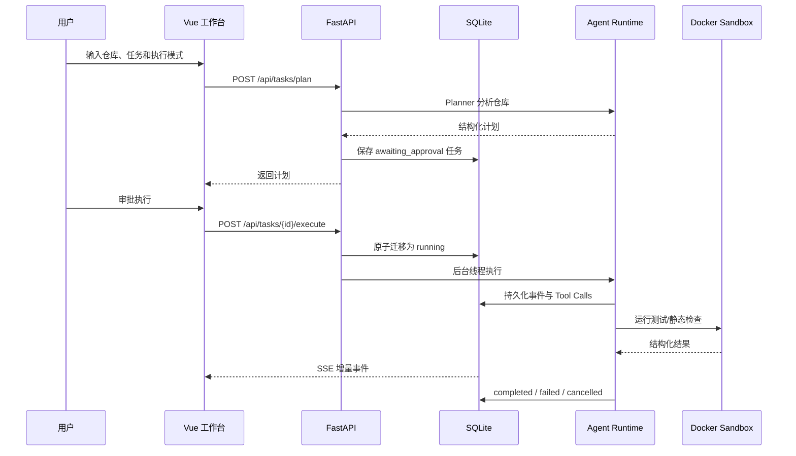
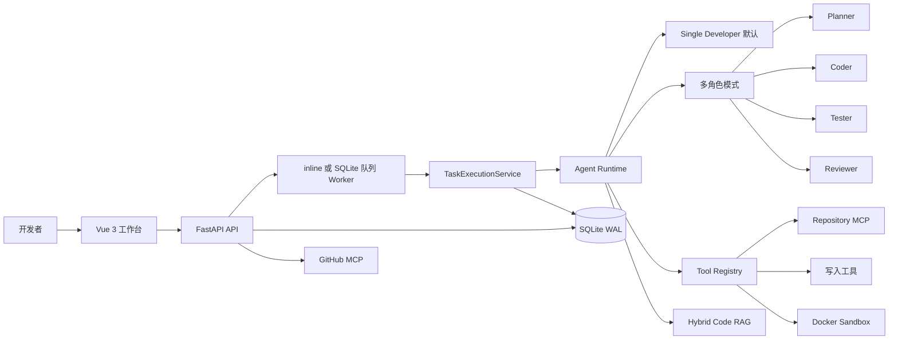
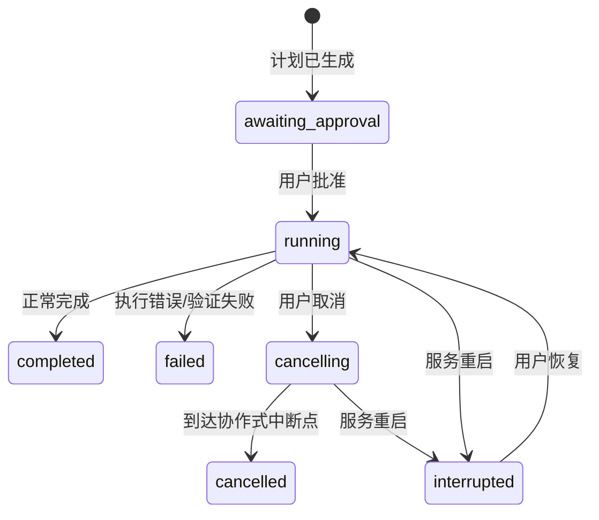
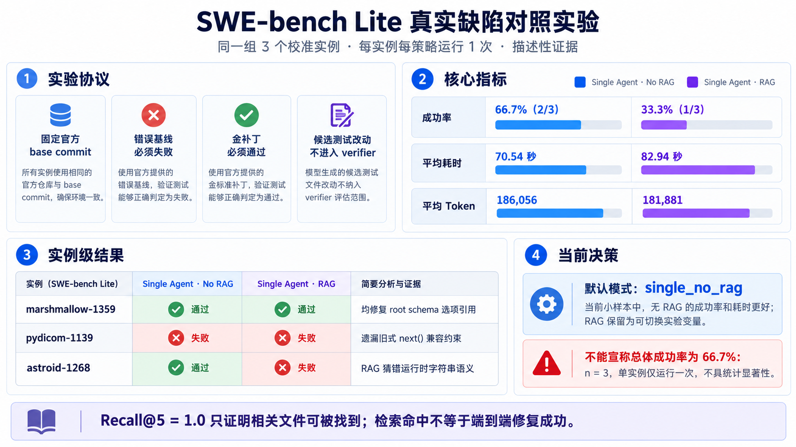

# DevPilot 技术知识库

> 面向 AI 应用／Agent 开发学习、项目答辩与面试复盘。本文以当前仓库代码和 2026-10-03 前完成的真实实验为准。凡涉及成功率和性能的数据，均注明数据集、样本数与限制。

🍦 **阅读建议**：第一次阅读按“一 → 四 → 五 → 七”的顺序建立全局认识；准备面试时重点阅读“一、六、七、十一”；需要复现项目时直接阅读“八”。



> 封面是能力概览，不是执行时序图。默认使用 Single Developer；Repository MCP 只读，写代码走本地受控工具，GitHub 发布走单独审批流程。

*图 1：DevPilot 将仓库理解、计划、代码修改、隔离测试、审查与可追踪事件组织为一条受控工程链路。*

---

## 一、🎾 项目简介与简历写法

### 1.1 项目是什么

DevPilot 是一个面向真实代码仓库的 AI 软件工程平台。用户可以输入本地开发任务，也可以导入 GitHub Issue；系统先分析仓库并生成计划，等待人工审批后，再由 Agent 调用代码检索、文件修改、测试和 Git Diff 等工具完成任务。



> 该图为自动化 UI fixture 演示（任务 ID 含 mock-task），用于说明界面布局，不是 DeepSeek 真实修复成功的证据。

*图 2：真实运行界面同时呈现计划、Agent Trace、测试结果、Diff、Review 与 Publish 入口。*

项目解决的核心问题不是“让大模型聊天”，而是把不稳定的模型输出约束在一条可观察、可验证、可中断的工程流程中：

1. **LLM 负责推理和选择工具**，不直接接触宿主机 Shell。
2. **工具层负责执行动作**，并实施路径、权限和命令边界。
3. **独立测试负责裁决结果**，Agent 的文字声明不算成功。
4. **SQLite Trace 负责保存过程**，浏览器断线不会终止后台任务。
5. **人工审批负责高风险边界**，代码执行和 GitHub 发布分别确认。
6. **评测系统负责验证价值**，同时保留成功案例和失败案例。

### 1.2 技术栈

| 层次 | 技术 |
|---|---|
| 前端 | Vue 3、TypeScript、Pinia、Vue Router、Vite、SSE |
| API 与服务 | Python 3.12、FastAPI、Pydantic、Loguru |
| Agent Runtime | OpenAI-compatible Tool Calling、自研事件流、多角色编排、上下文压缩 |
| 模型 | DeepSeek 等 OpenAI-compatible 模型，通过 `LLM_BASE_URL` 和 `LLM_MODEL` 接入 |
| RAG | AST/结构化分块、Sentence Transformers、BM25、RRF 混合检索 |
| 工具协议 | MCP Repository Server、MCP GitHub Client、本地受控写入工具 |
| 安全执行 | Docker Sandbox、命令白名单、只读挂载、禁网与资源限制 |
| 持久化 | SQLite、WAL、任务事件与 Tool Call Trace |
| 评测 | 自建 12-case Benchmark、SWE-bench Lite、Bootstrap、Wilcoxon |
| 部署 | Docker Compose、Nginx、Docker named volume |

### 1.3 可直接用于简历的项目描述

**DevPilot 多智能体软件工程平台｜AI 应用／Agent 开发**

项目简介：面向真实代码仓库设计并实现可执行、可观测、可评测的 Agent 平台，支持本地任务和 GitHub Issue 导入，通过 Planner、Coder、Tester、Reviewer 流程完成代码修改，并以 Docker 独立验证、人工审批和 SQLite Trace 约束执行风险。

负责内容：

1. **Agent Runtime**：抽象 `BaseToolAgent` 工具循环，统一处理 Tool Calling、事件流、Token/耗时统计、错误观测回填、最大迭代和协作式取消。
2. **多 Agent 编排**：实现 Planner → Coder → Tester → Reviewer 流程，将测试失败报告回传 Coder，最多进行 2 轮修复，避免无界循环。
3. **权限与沙箱**：按角色暴露工具白名单，并在执行层二次校验；测试命令在禁网、只读挂载、512 MB 内存、1 CPU、128 进程上限的 Docker Sandbox 中执行。
4. **Hybrid Code RAG**：实现代码结构化分块、384 维向量检索、BM25 与 RRF 融合；9 条标注查询达到 Recall@5 1.0、MRR 0.7222。
5. **可靠任务执行**：将 Agent 执行从 SSE 连接中解耦，事件写入 SQLite；支持断线续传、取消、进程重启后的中断识别与显式恢复。
6. **评测闭环**：构建 12 个独立 verifier 的合成任务，并引入 SWE-bench Lite 真实缺陷、基线/金补丁校准、测试文件保护和运行证据持久化。
7. **上下文成本优化**：保留原始 Issue 和最近完整回合，将旧工具历史压缩为结构化摘要；在同一长任务上 Token 从 131,182 降到 93,741，下降 28.5%。

### 1.4 面试时如何用一分钟介绍

> DevPilot 是我做的代码 Agent 工程化项目。它不是简单调用一次大模型，而是让模型通过受控工具读取和修改真实仓库。任务先生成计划并由用户审批，执行过程进入后台线程，所有事件和工具调用写入 SQLite，因此前端断线后可以继续接收。测试在只读、禁网、限资源的 Docker 容器中运行，最终是否成功由独立 verifier 决定。我还实现了 Hybrid Code RAG 和四种 Agent/RAG 组合的评测。真实 SWE-bench 小样本中，无 RAG 默认策略通过 2/3，RAG 只通过 1/3，所以产品默认值根据实验设为 `single_no_rag`，而不是为了展示技术强行开启 RAG。

### 1.5 项目能证明什么

这个项目可以证明以下能力：

- 能把 LLM 变成具有工具、状态和反馈回路的 Agent。
- 理解模型能力与确定性软件系统之间的边界。
- 能实现 RAG、MCP、沙箱、SSE、Tracing 和评测，而不只会调用 SDK。
- 能用失败数据修正产品默认策略。
- 能区分 Demo、实验结论和生产系统。

当前不能宣称“自动解决所有真实 Issue”或“已经生产可用”。真实留出集只有 4 个有效实例，且单实例只运行一次；SQLite 后台线程也仍是单机架构。

---

## 二、🥝 前置知识

### 2.1 LLM、Tool Calling 与 Agent

LLM 本身只生成文本或结构化参数。所谓 Agent，是在模型外部增加一个循环：

```text
用户任务
  ↓
LLM 判断下一步
  ↓
需要工具？ ──否──> 输出最终答案
  │是
  ↓
运行受控工具
  ↓
把工具结果作为 observation 交还 LLM
  └──────────────> 下一轮判断
```

DevPilot 的 `BaseToolAgent.run_stream()` 就是这个循环。每轮都会记录 `thinking`、`tool_call` 和 `tool_result` 事件；达到最大轮数、超过 Token 预算或发生异常时，必须输出明确的 `error`，不能假装完成。

### 2.2 State 与 Event 的区别

- **State** 表示某一时刻的完整状态，例如当前轮次、修改文件、测试报告和累计 Token。
- **Event** 表示刚刚发生的动作，例如开始、工具调用、角色交接、测试结果或错误。

DevPilot 在 Agent 内部用 `AgentState` 聚合状态，对外用 `AgentEvent` 传输增量事件。事件比反复传输完整 State 更适合 SSE，也更容易持久化和回放。

### 2.3 SSE 流式会话

SSE 是基于 HTTP 的服务端单向事件流，浏览器使用 `text/event-stream` 持续接收消息。它比 WebSocket 更适合“客户端提交任务，服务端持续推送进度”的场景。

早期常见错误是把 Agent 生成器直接绑定在 SSE 请求上：浏览器断线，生成器被销毁，任务也停止。DevPilot 的处理方式是：

1. `/execute` 原子地把任务从 `awaiting_approval` 改成 `running`。
2. 后台线程独立运行 Agent。
3. 每条事件先写入 SQLite，并分配递增 `sequence`。
4. SSE 只轮询并转发数据库中的新增事件。
5. 客户端用 `after_sequence` 从断点继续。

因此，**连接的生命周期不再等于任务的生命周期**。

### 2.4 多 Agent 与工作流

多 Agent 并不天然优于单 Agent。角色拆分的价值是隔离职责和权限：

| 角色 | 主要职责 | 是否可写代码 |
|---|---|---:|
| Planner | 理解需求、定位文件、输出计划 | 否 |
| Coder | 阅读和修改必要文件、检查 Diff | 是 |
| Tester | 在沙箱中运行测试、输出测试报告 | 否 |
| Reviewer | 独立审查需求满足度和边界问题 | 否 |
| Orchestrator | 调度、交接、返工和终止判断 | 不直接写 |

角色越多，结构化输出失败、上下文重复和延迟也越多。DevPilot 因此同时保留单 Agent 与多 Agent 模式，用实验选择默认值。

### 2.5 Human-in-the-loop

高风险动作不能只靠 Prompt 约束。DevPilot 设置了两个明确审批点：

1. **执行审批**：Planner 只生成计划，用户批准后 Coder 才能修改文件。
2. **发布审批**：系统先生成 PR Preview 和代码快照，用户确认后才创建分支、提交并发布 Draft PR。

第二个审批点还会重新计算 `snapshot_hash`。如果审批后文件发生变化，发布会被阻止，避免用户批准的内容与实际推送内容不一致。

### 2.6 MCP

MCP 将“模型可调用的工具”抽象为可发现的协议服务。DevPilot 把仓库只读能力放在 Repository MCP Server 中：

- `list_files`
- `read_file`
- `search_code`
- `retrieve_code`
- `git_diff`

客户端在一次 Agent 运行开始时进行 tool discovery，再按角色白名单过滤。写文件和执行命令仍保留为本地受控工具，因为它们需要更严格的路径、权限和沙箱边界。

### 2.7 Hybrid Code RAG

普通 RAG 面向自然语言文档，Code RAG 还要保留文件、符号和行号信息。DevPilot 的索引流程是：



*图 3：仓库分块后分别进入向量检索与 BM25 词法检索，再由 RRF 融合并按文件去重。此图用于解释结构，下面的文字和公式是实现细节的准确依据。*

```text
仓库文件
  → 忽略依赖、构建目录和二进制文件
  → Python AST / 文本窗口分块
  → 生成带文件名和符号名的 embedding_text
  → all-MiniLM-L6-v2 生成 384 维归一化向量
  → 同时建立 BM25 语料
```

查询阶段分别取向量检索 Top 20 和 BM25 Top 20，再使用 Reciprocal Rank Fusion：

```text
RRF(d) = Σ 1 / (60 + rank_i(d))
```

最后按文件去重，每个文件只保留最高分 chunk，避免同一个测试文件的多个片段挤占全部结果。

混合检索的目的：

- 向量检索擅长语义相近但词面不同的查询。
- BM25 擅长函数名、配置项、异常名等精确词匹配。
- RRF 使用排名而非直接相加原始分数，避免两套分数尺度不一致。

### 2.8 为什么检索指标高，修复率仍可能下降

检索系统回答的是“相关文件能否被找到”，Agent 任务回答的是“模型能否基于证据完成正确修改”。两者之间还隔着理解、工具选择、运行时验证和兼容性推断。

DevPilot 的文件级检索 Recall@5 为 1.0，但 3 个 SWE-bench 实例中 RAG 修复率低于无 RAG。原因包括：

- 额外上下文会形成错误锚点。
- 检索结果可能相关，却不是决定行为的运行时证据。
- 小仓库本来就能通过 `list_files + search_code + read_file` 快速定位。
- RAG 增加索引和推理延迟。

所以 RAG 应当是可评测、可关闭、可按仓库规模启用的能力。

### 2.9 上下文压缩

Tool Calling 长任务会重复携带历史消息，输入 Token 往往呈近似二次增长。DevPilot 的确定性压缩策略是：

- 永久保留 system message 和用户原始 Issue。
- 完整保留最近 12 条消息。
- 把更早工具回合压缩为最多 6,000 字符的结构化记录。
- 保留已修改文件和最近测试结论。
- 裁剪点回退到 assistant tool call 边界，避免出现孤立 tool result。
- 单次工具 observation 最多进入上下文 10,000 字符。

这类压缩不会让模型“记住一切”，但能保证任务目标、近期因果链和关键事实仍然存在。

### 2.10 独立 Verifier

Agent 说“测试通过”不等于代码正确。DevPilot 将验证分为两层：

- 运行流程中的 Tester 为 Agent 提供反馈。
- 评测器在 Agent 结束后，从受保护的验证目标重新运行测试。

真实缺陷评测还会排除候选补丁对测试文件和测试配置的修改，防止 Agent 通过删除断言“修复”任务。

---

## 三、⚾️ 业务背景

### 3.1 使用场景

开发者面对一个不熟悉的仓库和 Issue 时，需要完成定位、修改、测试、审查和发布。普通聊天模型只能给建议；全自动 Agent 又可能误改文件、执行危险命令或错误宣称成功。

DevPilot 的目标用户是希望观察和控制执行过程的开发者，典型任务包括：

- 修复明确的后端 Bug。
- 修改配置传播逻辑。
- 实现一个范围受控的小功能。
- 从 GitHub Issue 生成计划并形成 Draft PR。
- 对比单 Agent、多 Agent、RAG 和无 RAG 的效果。

### 3.2 核心需求

| 类型 | 需求 |
|---|---|
| 功能 | 仓库分析、计划生成、代码修改、测试、Review、Diff、PR 发布 |
| 交互 | 实时进度、断线续传、取消、恢复、结果回放 |
| 安全 | 路径防逃逸、角色权限、命令白名单、沙箱、双重审批 |
| 可观测 | 事件、Tool Call、Token、LLM 耗时、工具耗时 |
| 可评测 | 独立 verifier、架构消融、原始结果和配置快照 |
| 可复现 | 固定数据集指纹、base commit、运行环境和 run ID |

### 3.3 设计原则

1. **测试结果优先于模型自述。**
2. **权限在代码层实施，不依赖 Prompt。**
3. **任务与浏览器连接解耦。**
4. **失败必须成为可分析数据。**
5. **所有高级能力都要有关闭后的对照组。**
6. **默认策略由当前证据决定。**

---

## 四、🐧 项目流程

### 4.1 本地任务主流程



> 此图展示多角色示例路径；默认单 Agent 不会依次运行独立 Tester/Reviewer，队列模式由 Worker 执行。

*图 4：流程图依据当前代码校对，覆盖计划审批、最多两轮测试返工、独立 Reviewer、SQLite 事件持久化、协作式取消、二次发布确认与 Snapshot Hash 门禁。*



### 4.2 多 Agent 流程

```text
Planner 输出计划
  ↓
Coder 修改代码并查看 Git Diff
  ↓
Tester 运行真实测试
  ├─ 失败：把 stdout/stderr 交还 Coder，最多返工 2 次
  └─ 通过：进入 Reviewer
  ↓
Reviewer 独立检查需求、边界和非必要修改
  ├─ approved = true：完成
  └─ approved = false：任务失败并返回 issues
```

Planner、Tester 和 Reviewer 的最终输出都要经过 Pydantic Schema 解析。结构不合法时系统会尝试提取 JSON、处理有限的格式问题；最终仍无法通过 Schema 时明确失败。

### 4.3 GitHub Issue 流程

1. 用户填写 owner、repo、Issue 编号和本地仓库路径。
2. GitHub MCP 读取 Issue 标题、正文和元数据。
3. 系统把 Issue 转换为完整开发请求。
4. Planner 生成计划并保存任务来源。
5. 后续执行流程与本地任务一致。
6. 完成后生成只读 PR Preview。
7. 用户二次审批后创建分支、提交文件并发布 Draft PR。

### 4.4 取消、断线与恢复

- **取消**：状态先变为 `cancelling`，后台设置 `threading.Event`；Agent 在每轮模型调用和工具调用边界检查，随后写入 `cancelled`。
- **断线续传**：前端记录最后事件序号，重连 `/events?after_sequence=N`。
- **进程重启**：inline 模式启动时标记遗留任务为 `interrupted`；队列模式 API 重启不修改独立 Worker 的任务状态。
- **恢复**：用户显式调用 `/resume`，系统从已经批准的计划重新执行。

现已支持模型消息检查点；流程仍从执行入口重新进入，不是多角色阶段的事务恢复。详见 10.2。

---

## 五、🏗️ 系统架构

### 5.1 总体架构



### 5.2 分层职责

| 层 | 目录 | 作用 |
|---|---|---|
| Web | `frontend/src` | 任务创建、审批、事件流、Diff、评测看板 |
| API | `backend/src/main.py` | HTTP/SSE 接口、异常映射、生命周期 |
| Agent | `backend/src/agents` | 基础工具循环、角色 Prompt 与编排 |
| Service | `backend/src/services` | 后台执行、发布、Trace、仓库分析、评测查询 |
| Tool/MCP | `backend/src/tools`、`mcp_*` | 工具发现、权限过滤和实际执行 |
| RAG | `backend/src/rag` | 分块、Embedding、BM25、混合检索 |
| Sandbox | `backend/src/sandbox` | Docker 隔离执行 |
| Data | `backend/src/database` | SQLite 连接、表结构与 Repository |
| Evals | `backend/src/evals` | 合成任务、真实缺陷、统计和报告 |

消息检查点保存在 `agent_contexts`，队列项保存在 `task_queue`；它们和任务状态是不同记录，必须同时检查。

### 5.3 任务状态机



关键状态迁移使用带旧状态条件的 SQL Update，即 compare-and-set。这样两个并发执行请求只有一个能够把 `awaiting_approval` 改成 `running`。

### 5.4 数据模型

SQLite 主要表：

| 表 | 内容 |
|---|---|
| `tasks` | 仓库、任务、状态、执行模式和时间 |
| `plan_steps` | Planner 的结构化步骤 |
| `agent_events` | 带 sequence 的持久化事件 |
| `tool_calls` | 工具名、参数、结果预览、耗时和成功状态 |
| `task_sources` | GitHub Issue 等任务来源 |
| `publish_previews` | PR 草稿、文件列表、快照 Hash 和审批状态 |
| `evaluation_results` | case、variant、成功率、Token、耗时等原始实验记录 |

数据库启用外键和 WAL。WAL 可以提升单机读写并发，但不能代替多实例任务队列。

---

## 六、🧩 核心实现拆解

### 6.1 BaseToolAgent：统一工具循环

`backend/src/agents/base_tool_agent.py` 处理所有角色共有的机制：

1. 初始化 State 并发送 `start`。
2. 发现 MCP 工具并按白名单过滤。
3. 压缩旧上下文。
4. 调用 OpenAI-compatible Chat Completions。
5. 累加 Token 和 LLM 耗时。
6. 解析 Tool Call 参数并发送 `tool_call`。
7. 在注册表执行工具，把异常也转换为 observation。
8. 截断过长工具结果并发送 `tool_result`。
9. 无工具调用时输出 `final`。
10. 最大轮数后进行一次禁止工具的强制收尾；仍不合法则失败。

将循环集中在基类，可以让角色只定义 Prompt、工具权限和迭代上限。

### 6.2 两层工具权限

第一层在 `get_tool_definitions()`：模型只能看见当前角色允许的工具。

第二层在 `execute_tool()`：即使手工构造了未授权 Tool Call，执行时仍会抛出 `PermissionError`。

这叫 **defense in depth**。只隐藏工具 Schema 不足以形成安全边界。

### 6.3 文件安全

所有文件路径先与仓库根目录拼接，再执行 `resolve()`，最后通过 `relative_to(base_path)` 确认目标仍位于仓库内。因此 `../../secret` 和指向仓库外的符号链接都会被拒绝。

文件读取还有两类限制：

- 磁盘文件默认不能超过 1 MB。
- 进入上下文的内容按字符数截断。

Coder 修改大文件时优先使用唯一原文锚点的 `replace_in_file`，减少整文件重写带来的误删风险。

### 6.4 Docker Sandbox

允许的程序包括 `python`、`pytest`、`ruff`、`mypy`，以及跨语言扩展的 `node`、`npx`、`javac`、`java`；具体以 `sandbox/docker_runner.py` 的白名单为准。执行参数使用数组并设置 `shell=False`，不会把模型输出交给 Shell 解释。

容器限制：

```text
--network none
--memory 512m
--cpus 1.0
--pids-limit 128
--read-only
--tmpfs /tmp:rw,noexec,nosuid,size=64m
--mount source=<repo>,target=/workspace,readonly
```

测试命令可以读取候选代码，但不能借测试过程修改宿主机仓库，也不能访问外网。

### 6.5 结构化输出

Planner、Tester 和 Reviewer 分别映射到 `PlannerOutput`、`TesterOutput` 和 `ReviewerOutput`。结构化输出层会：

- 从 Markdown 代码块或混合文本中提取 JSON。
- 对常见控制字符问题做有限修复。
- 最终使用 Pydantic 校验字段和类型。
- 将 Reviewer 偶发输出的对象型 issues 规范化为字符串列表。

宽容解析只处理表达形式，不能绕过语义 Schema。

### 6.6 后台执行与 Trace

`TaskExecutionService` 为每个运行任务维护后台线程和取消事件。执行产生的事件会先保存，再由 SSE 查询。Tool Result 同时提取为独立 `tool_calls` 记录，因此可以计算：

- 总事件数和 Tool Call 数。
- 失败工具数。
- 总 Token 与估算成本。
- LLM 耗时和工具耗时。
- 每个 Agent 的调用分布。
- RAG 调用次数和检索耗时。

### 6.7 发布一致性

发布前收集变更文件并计算快照 Hash，Preview 保存目标分支、Head 分支、Commit Message、PR 标题和正文。真正发布时再次计算 Hash；任何变更都会使旧审批失效。

这种做法对应安全系统中的 TOCTOU 防护：检查时的内容必须与使用时的内容一致。

---

## 七、🧪 评测设计与真实结果

### 7.1 为什么需要三层评测

| 层次 | 回答的问题 | 数据 |
|---|---|---|
| 数据集审计 | 用例初始状态是否真的失败 | 12 个合成 fixture |
| 组件评测 | RAG 是否能检索到目标文件 | 9 条文件级标注查询 |
| 端到端评测 | Agent 是否能真正修复缺陷 | 合成任务 + SWE-bench Lite |

只做组件评测会把“找得到文件”误当成“修得好代码”；只展示 Demo 又无法知道失败率。

### 7.2 四种架构变量

- `single_no_rag`
- `single_rag`
- `multi_no_rag`
- `multi_rag`

每次运行记录成功、测试结果、工具调用、迭代、返工、耗时、Token、LLM/工具耗时、工作区和错误信息。

### 7.3 合成回归

当前共有 12 个 fixture：9 个旧 Python 基础任务，以及 TypeScript、Java、Python 跨模块大型 Issue 各 1 个；类别包括 bugfix、configuration、cross-module、feature 和 validation。审计确认 12/12 初始 verifier 失败。下面的 18 次 A/B smoke 是扩容前 9 个旧 Python 任务的历史可比基线，不能误读为当前数据集只有 9 个任务。

当前 smoke 共执行 18 次：

| 模式 | 成功率 | 平均耗时 | 平均 Token | 平均工具调用 |
|---|---:|---:|---:|---:|
| `single_no_rag` | 100% | 17.29 秒 | 11,733 | 8.44 |
| `single_rag` | 100% | 19.85 秒 | 12,314 | 8.67 |

它证明当前实现没有破坏已知能力，但不能代表真实仓库上的总体性能。

### 7.4 RAG 检索评测

| 指标 | 结果 |
|---|---:|
| 查询数 | 9 |
| Recall@5 | 1.0 |
| MRR | 0.7222 |
| 平均查询耗时 | 约 9.2 ms |
| 平均索引构建耗时 | 约 1.25 秒 |

首个索引构建包含 Embedding 模型冷启动，因此明显慢于后续样本。

### 7.5 SWE-bench Lite 真实缺陷

每个实例固定官方 base commit，在官方镜像中先验证错误基线失败、金补丁通过，再运行 Agent。候选测试改动不会进入 verifier。

这里的“镜像”是 Docker 测试环境，不是实验结果或文档配图。可以把它理解成每道真实 Issue 配套的标准考场：镜像中封装了当时的 Python、依赖和测试工具；运行时临时创建容器，测试结束后删除容器但保留镜像。因为不同 Issue 的年代和依赖不同，不能直接用宿主机的一套环境统一判分。

需要区分三个数字：

| 名称 | 含义 | 是否进入成功率 |
|---|---|---:|
| 23 个候选实例 | 可以分层抽样的真实 Issue 题库 | 否 |
| 本地已缓存镜像 | 已经下载好的标准测试环境 | 否 |
| 已完成 Agent 运行 | 模型实际修改代码并由 verifier 判分 | 是 |

单个实例的判分链路是：原始代码必须测试失败，官方金补丁必须测试通过，然后才让 Agent 在原始代码上修复；最终 verifier 会排除 Agent 对测试文件的修改，只对生产代码补丁重新运行官方目标测试。环境校准失败的实例不会调用模型，也不会进入分母。

本机 Docker 中与 DevPilot 相关的镜像分为四类：

| 镜像名称 | 用途 |
|---|---|
| `devpilot-sandbox:py312` | 日常 Python 任务的轻量隔离测试环境 |
| `devpilot-sandbox:polyglot` | 合成 benchmark 的 TypeScript / Java 测试环境 |
| `swebench/sweb.eval.x86_64.*` | 每道 SWE-bench 真实 Issue 的官方复现环境 |
| `devpilot-backend`、`devpilot-frontend`、`github-mcp-server` | 运行产品本身或 GitHub MCP，并非评测样本 |



> 图中“相同仓库与 base commit”仅指同一道题的不同实验组配对，不同实例各用自己的提交。图内耗时不能理解为全流程等待；判分使用自研 verifier，已知环境失败可能被排除。

*图 5：同一组 3 个校准实例的描述性对照。每个实例、每种策略只运行一次，结果用于决定当前默认策略，不代表总体成功率。*

| 实例 | 无 RAG | RAG | 观察 |
|---|---:|---:|---|
| `marshmallow-1359` | 通过 | 通过 | 两种策略均修复 root schema 选项引用 |
| `pydicom-1139` | 失败 | 失败 | 遗漏旧式 `next()` 兼容约束 |
| `astroid-1268` | 通过 | 失败 | RAG 运行猜错运行时字符串语义 |
| **汇总** | **2/3** | **1/3** | 样本很小，不具统计显著性 |

无 RAG 平均耗时约 70.54 秒，平均 Token 约 186,056；RAG 平均耗时约 82.94 秒，平均 Token 约 181,881。当前证据支持把 `single_no_rag` 设为默认模式。

### 7.6 留出验证

上下文优化后，4 个未参与调参的实例使用默认模式：

| 实例 | 结果 | Token | 耗时 |
|---|---:|---:|---:|
| `marshmallow-1343` | 通过 | 120,093 | 109.57 秒 |
| `pydicom-1256` | 通过 | 98,207 | 50.46 秒 |
| `astroid-1196` | 失败 | 104,942 | 73.06 秒 |
| `pydicom-1694` | 通过 | 74,317 | 57.42 秒 |
| **汇总** | **3/4** | **平均 99,390** | **平均 72.63 秒** |

失败样本显示：模型会用不同作用域的对象替代 Issue 原始复现，并误判生成器异常边界。这类失败比成功案例更有价值，因为它直接指向运行时探针和协议兼容检查能力的缺口。

**后续真实结果（2026-10-04）**：分层抽样 20 题，9 题未通过校准；通过校准的 11 题各运行 3 次，共 21/33 次通过本项目文件级 verifier，按题为 7/11。四个失败题各 0/3。针对失败题增加轮数、改用 DeepSeek Pro 和高强度思考的单次探索均未观察到通过率提升；执行层“编辑阶段仍可运行搜索工具”的漏洞虽已修复，astroid-1333 同题重跑仍未通过。完整配置、run_id、Token 与失败点见[当前评测记录](current-evaluation.md)。这些数据来自自研 verifier，不能与官方 SWE-bench 榜单直接比较。

### 7.7 如何正确表达实验结论

可以说：

- “在 9 个合成回归任务中，单 Agent 两种模式均通过独立 verifier。”
- “文件级 RAG 在 9 条标注查询上 Recall@5 为 1.0。”
- “首轮 3 个真实缺陷中，无 RAG 通过 2/3、RAG 通过 1/3，因此暂用无 RAG 为默认；后续需同题配对验证。”

不应说：

- “DevPilot 修复真实 Bug 的成功率是 75%。”
- “RAG 已经显著提升代码修复效果。”
- “多 Agent 一定比单 Agent可靠。”

因为样本量、重复次数和仓库类型都还不足以支持这些泛化结论。

---

## 八、🚀 本地运行与部署

### 8.1 环境要求

- Python 3.12
- uv
- Node.js 22
- Git
- Docker Desktop（运行 Sandbox、Compose 和真实评测时需要）
- OpenAI-compatible API Key，例如 DeepSeek

### 8.2 后端启动

```powershell
Copy-Item backend\.env.example backend\.env
# 编辑 backend/.env，至少填写 LLM_API_KEY、LLM_BASE_URL、LLM_MODEL
uv sync
uv run uvicorn backend.src.main:app --reload
```

API 文档：`http://127.0.0.1:8000/docs`

### 8.3 前端启动

```powershell
Set-Location frontend
npm ci
npm run dev
```

工作台：`http://127.0.0.1:5173`

### 8.4 测试

```powershell
uv run python -m pytest

Set-Location frontend
npm test
npm run build
```

### 8.5 Docker Compose

```powershell
Copy-Item .env.example .env
Copy-Item backend\.env.example backend\.env
docker compose up --build
```

访问 `http://localhost:8080`。SQLite 位于 named volume `devpilot_data`，普通容器重建不会删除历史数据。

Compose 为了在本地演示中启动 Sandbox，会把 Docker Socket 挂载到 Backend。这个权限接近宿主机管理员能力，不能直接照搬到公网生产环境。

### 8.6 核心配置

| 配置 | 作用 | 默认值 |
|---|---|---|
| `LLM_API_KEY` | 模型密钥 | 空 |
| `LLM_BASE_URL` | OpenAI-compatible 地址 | 空 |
| `LLM_MODEL` | 模型名称 | 空 |
| `LLM_REASONING_EFFORT` | DeepSeek 思考强度 `low` / `high` / `max`；留空沿用接口默认行为 | 空 |
| `LLM_TIMEOUT_SECONDS` | 单次模型请求超时 | 60 |
| `LLM_MAX_RETRIES` | 瞬时错误重试 | 2 |
| `AGENT_TOKEN_BUDGET` | 单 Agent Token 上限，0 为不限制 | 0 |
| `AGENT_RECENT_MESSAGES` | 完整保留最近消息数 | 12 |
| `TOOL_OBSERVATION_MAX_CHARS` | 单次工具结果上下文上限 | 10,000 |
| `DATABASE_PATH` | SQLite 路径 | `backend/data/devpilot.db` |
| `WORKSPACE_ROOT` | Backend 可见工作区 | `/workspace` |
| `HOST_WORKSPACE_ROOT` | Docker daemon 可见宿主机路径 | 空 |

### 8.7 核心 API

| 方法 | 路径 | 作用 |
|---|---|---|
| `POST` | `/api/tasks/plan` | 生成计划和待审批任务 |
| `POST` | `/api/tasks/{id}/execute` | 原子领取并执行任务 |
| `GET` | `/api/tasks/{id}/events` | SSE 断线续传 |
| `POST` | `/api/tasks/{id}/cancel` | 协作式取消 |
| `POST` | `/api/tasks/{id}/resume` | 恢复 interrupted 任务 |
| `GET` | `/api/tasks/{id}` | 任务、事件和 Tool Calls |
| `GET` | `/api/tasks/{id}/metrics` | Token、成本和耗时 |
| `GET` | `/api/tasks/{id}/diff` | 当前 Git Diff |
| `POST` | `/api/github/issues/import` | 从 GitHub Issue 创建任务 |
| `POST` | `/api/tasks/{id}/publish-preview` | 生成发布预览 |
| `POST` | `/api/tasks/{id}/publish` | 审批后发布 Draft PR |
| `GET` | `/api/evals/summary` | 评测汇总 |

### 8.8 常见问题

**Docker Sandbox 报路径不存在**

Compose 中应使用容器路径 `/workspace/<project>`，不能把 Windows 的 `E:\...` 直接传给 Backend。

**模型可以聊天但任务执行失败**

检查 `LLM_MODEL` 是否支持 Tool Calling，并确认兼容端点会返回 `tool_calls` 和 usage。

**SSE 断开后页面没有后续事件**

读取任务详情确认后台状态，再使用最后收到的 sequence 请求 `/events?after_sequence=N`。

**测试无法启动**

先运行 `docker info`，再确认 `devpilot-sandbox:py312` 镜像存在以及工作区路径可被 Docker daemon 访问。

---

## 九、📁 目录结构与学习路径

```text
DevPilot/
├── backend/
│   ├── src/
│   │   ├── agents/       # Agent 循环与多角色编排
│   │   ├── database/     # SQLite 和 Repository
│   │   ├── evals/        # 合成/真实评测与统计
│   │   ├── mcp_clients/  # Repository/GitHub MCP 客户端
│   │   ├── mcp_servers/  # Repository MCP Server
│   │   ├── rag/          # 分块、Embedding、BM25、RRF
│   │   ├── sandbox/      # Docker 隔离执行
│   │   ├── services/     # 执行、发布、Trace 等业务服务
│   │   └── tools/        # 文件、写入、测试和注册表
│   ├── benchmarks/       # 12 个可执行 fixture
│   └── tests/            # 单元、集成和评测测试
├── frontend/src/         # Vue 工作台和 Evaluation Dashboard
├── docs/                 # 实验与技术文档
├── docker-compose.yml
└── pyproject.toml
```

建议阅读顺序：

1. `backend/src/models/agent_state.py`：先理解 State/Event。
2. `backend/src/agents/base_tool_agent.py`：理解 Tool Calling 循环。
3. `backend/src/tools/registry.py`：理解工具发现和权限。
4. `backend/src/agents/orchestrator.py`：理解多 Agent 交接和返工。
5. `backend/src/services/task_execution_service.py`：理解后台执行与 SSE 解耦。
6. `backend/src/rag/code_index.py`：理解混合检索。
7. `backend/src/evals/runner.py` 和 `real_world.py`：理解独立评测。
8. 最后阅读前端 Store 和工作台，观察事件如何映射到 UI。

---

## 十、🛡️ 已实现能力、证据边界与改进顺序

> 2026-10-03 复核：功能代码、离线测试、真实实验和生产验收是四个不同层级。此前“全部已解决”的表述已撤回。详见 [项目复核](project-review.md)。

### 10.1 当前能力与验收状态

| 能力 | 已实现内容 | 证据与尚未解决的问题 |
|---|---|---|
| 扩样评测 | 23 题候选池、分层选择、重复参数和描述统计 | 第五轮已抽样 20 题，9 题未通过校准；11 题各运行 3 次，21/33 成功，包含既有开发题。 |
| 协议探针 | Python 沙箱探针、提示词检查单 | 工具可运行；尚无独立消融证明提高成功率 |
| 动态 RAG | 源文件数量和查询定位信号的启发式规则 | API 与 Worker 现共享策略；阈值并非通过大仓库对照实验优化所得 |
| Token 优化 | 观测去重、历史摘要、缓存 usage 统计 | 单题成本下降，合成小任务成本反而上升；无总体净收益结论 |
| API/Worker 分离 | SQLite 队列、领取、心跳、失败重试、死信 | 租约丢失采用隔离后人工恢复；Redis 为非原子实验实现；无多机生产验收 |
| 隔离部署 | Docker 沙箱与独立 daemon 配置入口 | K8s 清单是示例；每任务 Job 和 Firecracker 适配器均未实现 |
| 跨语言任务 | TS、Java、Python 跨模块各一个合成 fixture | fixture 可验收不等于 Agent 已修好真实跨语言 Issue |
| 消息恢复 | 角色消息保存、加载、恢复事件 | 不是编排阶段检查点，也不保证工具只执行一次 |

### 10.2 如何正确理解恢复

`agent_contexts` 以任务 ID 和角色名保存最近一次完整工具回合后的消息。恢复时校验工具调用与结果配对，保留 system 和原始请求；超出消息上限时按完整回合裁剪。损坏的旧检查点回退为新上下文，并记录日志。注入快照只消费一次，之后的修复轮使用新的失败反馈。

多角色模式仍从 `execute_stream` 入口运行；已完成阶段、返工轮数、文件修改和外部工具副作用没有统一事务。因此断电可能发生在“文件已改，快照尚未写入”的窗口。恢复前要检查工作区，不能把消息恢复描述为无损接续整个工作流。

SQLite 队列中租约过期会把队列项隔离为 `dead`，并把运行中的任务置为 `interrupted`。确认旧 Worker 已停止后才可显式 `/resume`。租约超时本身不能证明旧进程停止，当前没有跨进程 fencing，因此不自动把写代码任务交给另一 Worker。

### 10.3 下一轮优先验收

1. 冻结模型、提示词和测试判分，使用未调参的新任务，按题配对重复比较默认策略、动态 RAG 和多角色模式；报告失败与环境无效项。
2. 第五轮已在校准阶段持久化部分报告并逐行更新。下一步需解决 9/20 题校准未过的问题，接入官方 harness，对外比较时记录镜像 digest、模型版本与完整成本口径。
3. 为 Worker 增加真正的执行 fencing、并发上限、仓库级互斥和故障注入；验收后才讨论自动故障切换。
4. 面向服务部署补鉴权、仓库授权、配额、审计和统一状态存储；远程 Docker 必须解决远端工作区路径一致性。

---

## 十一、💬 高频面试问题

### 11.1 为什么默认使用单 Agent 无 RAG？

因为当前真实小样本中它的修复率和耗时更好。RAG 的检索指标虽然优秀，但没有转化为端到端收益。项目保留四种模式用于后续扩样验证，而默认值遵循现有证据。

### 11.2 多 Agent 的价值是什么？

主要价值是职责、权限和验证视角的隔离，例如 Tester 不可写文件、Reviewer 独立读取 Diff。它的代价是更多模型调用、结构化输出边界和编排失败点，所以需要和单 Agent 做消融实验。

### 11.3 为什么不用 LangGraph？

当前流程对事件结构、持久化、取消点、Token 统计和错误语义有明确要求，自研小型 Runtime 更容易展示底层机制并精确控制行为。生产项目是否选框架，应依据团队维护成本、生态和工作流复杂度，而不是为了“自研”本身。

### 11.4 如何防止 Agent 执行危险命令？

Prompt 只是第一层。真正边界由角色工具白名单、执行层二次权限检查、路径解析、命令白名单、`shell=False` 和 Docker Sandbox 共同实施。

### 11.5 如何证明任务真的成功？

评测中的 `success` 要求执行协议没有 error，并且独立 verifier 通过。产品任务的 `completed` 只表示执行流程正常结束，不保证独立验收通过。真实评测还会先校准错误基线与金补丁，并保护测试文件，避免模型篡改验收标准。

### 11.6 SSE 断线为什么不影响任务？

Agent 在后台线程中执行，事件写入 SQLite；SSE 只是数据库事件的消费者。重连时使用事件序号继续读取，所以连接和任务拥有独立生命周期。

### 11.7 RAG 为什么使用 RRF？

向量相似度和 BM25 分数不在同一尺度，直接加权需要额外归一化和调参。RRF 只依赖排名，简单稳定，并能奖励同时被两路检索排在前面的结果。

### 11.8 如果做成生产系统，最先改什么？

已有队列和独立 Worker 原型，下一步应先补执行 fencing、鉴权、配额、仓库互斥与故障演练，再验收远程 Docker 和多机状态存储。模型策略优化应建立在可靠执行基础设施之后。

---

## 十二、📌 证据与复现入口

- 当前真实评测结论：`docs/current-evaluation.md`
- 实验方法：`docs/EXPERIMENTS.md`
- 合成数据审计：`backend/benchmarks/audit_report.json`
- RAG 原始报告：`backend/data/retrieval_evals/<run_id>/report.json`
- 真实缺陷报告：`backend/data/real_world_evals/<run_id>/report.json`

```powershell
# 审计 12 个合成用例的初始失败状态
.venv\Scripts\python.exe -m backend.src.evals.audit

# 运行文件级 RAG 评测
.venv\Scripts\python.exe -m backend.src.evals.retrieval --top-k 5

# 运行合成 Agent 回归
.venv\Scripts\python.exe -m backend.src.evals.runner --full --repeats 1 `
  --variant single_no_rag --variant single_rag

# 运行 SWE-bench Lite 真实缺陷评测
.venv\Scripts\python.exe -m backend.src.evals.real_world `
  --variant single_no_rag --variant single_rag
```

> 最可靠的项目介绍方式，是同时给出代码、复现命令、原始报告和失败案例。DevPilot 的价值不在于声称 Agent 已经无所不能，而在于建立了一套可以持续验证和改进 Agent 的工程闭环。
