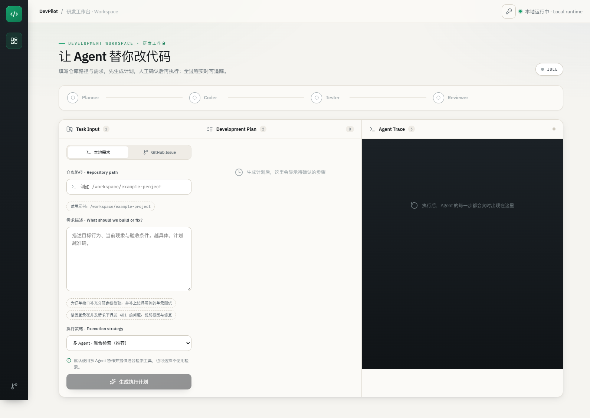

# DevPilot 用户说明书

版本 1.0　更新日期 2026 年 10 月 6 日

本说明书面向使用 DevPilot 处理代码仓库需求的开发者与项目负责人。阅读后可以完成部署、连接模型、创建任务、审批计划、观察执行、审查修改并发布 Draft PR。

## 一 项目介绍

DevPilot 把代码研发任务组织成可审批、可观察的操作流程。用户提供本地需求或 GitHub Issue，系统分析仓库并生成计划；用户批准后，Agent 调用代码工具和 Docker 沙箱执行任务。修改结果以 Diff、测试记录与评审内容呈现，由用户确认后进入 GitHub 发布流程。

平台支持单 Agent 与多角色协作。单 Agent 在一个上下文中完成阅读、修改和验证；多角色模式由 Planner、Coder、Tester、Reviewer 分工推进。工具权限、路径授权与任务状态由服务统一管理。

## 二 功能概览

| 功能 | 使用方式 |
|---|---|
| 本地需求 | 输入授权仓库路径和任务描述 |
| GitHub Issue | 输入仓库与 Issue 编号，导入标题和正文 |
| 计划审批 | 查看步骤，确认目标与验证范围后批准 |
| 代码操作 | 阅读、检索、结构导航、行为复现与修改 |
| 隔离验证 | 在 Docker 中执行测试和允许的命令 |
| 执行观察 | 查看角色事件、工具结果、轮次与用量 |
| 任务管理 | 取消运行任务、恢复中断任务、重连事件流 |
| 结果审查 | 查看彩色 Diff、测试及评审内容 |
| GitHub 发布 | 先生成发布预览，再确认创建 Draft PR |
| 评测结果 | 阅读最终结果包，或调用后端只读结果 API |



## 三 环境准备

Docker 启动方式需要 Docker Desktop 和 Git。Docker Desktop 应使用 Linux 容器模式，并允许挂载需要操作的仓库目录。

本地开发方式还需要 Python 3.12、uv 和 Node.js 22。浏览器建议使用当前版本的 Chrome、Edge 或 Firefox。

准备一个可调用 Tool Calling 的 OpenAI 兼容模型服务。模型地址、名称和凭据由部署者配置；平台不会把这些凭据写入运行镜像。

## 四 首次部署

### 1 配置仓库挂载

下载项目后进入 DevPilot 根目录，首次部署复制两个模板。已有配置文件时保留原文件，按需要修改对应字段。

```powershell
Copy-Item .env.example .env
Copy-Item backend/.env.example backend/.env
```

根目录 `.env` 控制宿主机挂载位置：

```dotenv
DEVPILOT_HOST_WORKSPACE_ROOT=E:/projects
```

这表示 `E:/projects` 映射为容器内 `/workspace`。例如宿主机的 `E:/projects/my-repository`，在工作台填写 `/workspace/my-repository`。

### 2 配置模型与访问凭据

在 `backend/.env` 填写：

```dotenv
LLM_API_KEY=填写模型服务凭据
LLM_BASE_URL=填写OpenAI兼容接口地址
LLM_MODEL=填写模型名称
API_KEYS=填写应用访问凭据
ALLOWED_REPO_ROOTS=/workspace
DATABASE_BACKEND=sqlite
TASK_QUEUE_BACKEND=inline
```

`LLM_API_KEY` 用于后端访问模型，`API_KEYS` 用于用户访问 DevPilot，两者用途不同。`API_KEYS` 可配置多个逗号分隔的凭据；仓库白名单限制任务能操作的目录。

上述示例使用 SQLite 保存业务记录，并在 API 进程内执行任务，不使用 Redis。填写 `MYSQL_URL` 或 `REDIS_URL` 只提供连接地址；实际使用哪个存储、队列由 `DATABASE_BACKEND` 和 `TASK_QUEUE_BACKEND` 分别决定。启动 MySQL、Redis 容器也不会自动切换这两个配置。

### 3 构建运行镜像

```powershell
docker compose build sandbox backend frontend
docker compose up -d backend frontend
docker compose ps
```

主要镜像包括后端、前端及 Python 执行沙箱。服务健康后，打开 `http://localhost:8080`。首次访问输入应用 API Key；可以通过工作台的钥匙入口更换或清除当前标签页的凭据。

需要在沙箱内处理 TypeScript、Java 等命令时，另行构建多语言沙箱：

```powershell
docker compose build sandbox-polyglot
```

## 五 创建与执行任务

### 1 选择仓库

输入部署白名单以内的仓库路径。Docker 部署使用 `/workspace/...`，本地开发直接使用宿主机的绝对路径。路径必须真实存在，仓库应具有可读取源码及用于验证的构建或测试命令。

### 2 描述需求

任务描述建议包含目标行为、当前现象、涉及模块、验收条件和相关测试命令。需求越明确，计划越容易审查。

```text
修复分页接口在 page_size 为 0 时返回异常的问题。
期望：拒绝非正整数，返回明确参数错误；正常分页保持原行为。
请先复现问题，再修改实现并运行相关测试。
```

导入 GitHub Issue 时，确认仓库与编号正确；系统把公开需求内容转换为开发任务。访问私有资源或执行发布时，需要配置具有相应权限的 GitHub 凭据。

### 3 审批计划

检查计划中的修改目标、步骤和验证范围。批准后系统开始执行。需求需要调整时，应先修订任务或计划，保证实际执行与批准内容一致。

### 4 观察执行

执行区持续显示角色状态、工具调用、测试结果和最终事件。浏览器连接与后台任务相互独立；重新连接后可以继续读取已持久化的事件。

工具轨迹可帮助理解 Agent 阅读了哪些文件、进行了什么修改、执行了哪些验证。耗时与模型 Token 属于执行记录，可以用于观察当前任务用量。

## 六 检索与执行模式

Hybrid Code RAG 对源码进行结构或窗口分块，组合关键词检索、向量检索和排名融合，为代码阅读提供相关片段。Python 结构导航还可呈现类、函数与行号，帮助定位大型模块。

当前工作台提供 `multi_rag` 与 `multi_no_rag`，默认多角色＋检索；后端 API 和研究工具仍保留 `single_*` 变体。`RAG_MODE=auto` 的仓库规模与查询信号启发式仅用于 `single_*` 执行策略。多角色模式由执行模式决定是否暴露检索工具，工具可见不代表模型一定调用过。单 Agent 的动态工具策略结合语言分布、目标文件规模与问题特征选择结构导航和行为探针。

行为复现用于观察修改前后的实际差异；测试记录用于验证实现。使用完整的相关测试命令，有助于把预期行为转化为可审查的证据。

## 七 取消与恢复

运行中的任务可以发起取消。服务先标记取消请求，Worker 或执行线程在安全点处理；最终业务状态为 `cancelled`。队列消费记录进入不可重试终态，不再次领取该任务。

服务重启后，工作台可能显示任务中断。恢复前确认旧执行者和工具已经停止，检查当前工作区 Diff，再发起恢复。系统读取持久化计划及可用的消息检查点，重新进入执行流程；用户应结合实际工作区状态审查可能重复的工具操作。

刷新页面或重新打开连接时，通过事件序号接续读取任务记录，不需要重新创建任务。

## 八 审查与发布

任务结束后，先检查 Diff，再核对测试命令、原始输出和评审内容。流程完成、测试通过和代码符合需求是不同的观察项，应结合验收条件判断是否接受修改。

准备发布时先生成 PR Preview，检查文件范围、提交内容和目标仓库，再确认创建 Draft PR。发布预览与工作区快照关联；工作区发生变化后，应重新生成预览并再次确认。

Draft PR 保留正常的团队评审流程。对重要仓库，可在合并前执行项目自己的 CI 与代码审查。

## 九 API 与 Worker 部署

默认 `inline` 在 API 进程内运行后台任务。需要将请求接收与执行进程分开时，配置持久化队列并启动 Worker：

```dotenv
TASK_QUEUE_BACKEND=sqlite
TASK_WORKER_MAX_CONCURRENCY=2
TASK_QUEUE_MAX_DEPTH=100
```

```powershell
docker compose --profile worker up -d backend frontend worker
```

SQL 队列随状态库使用 SQLite 或 MySQL；Redis 队列通过 Lua 管理领取和租约。API 与 Worker 应使用一致的存储、目录和凭据配置。SQLite 采用单机 Linux 数据卷；共享数据库部署可选择 MySQL。

状态库负责保存任务历史，队列负责安排任务执行，两者可以分别选择：

| `DATABASE_BACKEND` | `TASK_QUEUE_BACKEND` | 业务记录写入位置 | 排队与执行方式 |
|---|---|---|---|
| `sqlite` | `inline` | SQLite 文件 | API 进程内执行，不使用 Redis 或独立 Worker；默认配置 |
| `sqlite` | `sqlite` | SQLite 文件 | 队列写入同一 SQLite 的 `task_queue` 表，由 Worker 执行 |
| `sqlite` | `redis` | SQLite 文件 | 队列写入 Redis，由 Worker 执行 |
| `mysql` | `inline` | MySQL 数据库 | API 进程内执行，不使用 Redis 或独立 Worker |
| `mysql` | `sqlite` | MySQL 数据库 | 队列写入同一 MySQL 的 `task_queue` 表，由 Worker 执行 |
| `mysql` | `redis` | MySQL 数据库 | 队列写入 Redis，由 Worker 执行 |

配置名 `TASK_QUEUE_BACKEND=sqlite` 是 SQL 队列的历史命名，其底层数据库跟随 `DATABASE_BACKEND`，不表示一定写入 SQLite。选择 `redis` 时，Redis 保存排队、领取、租约、心跳及重试等队列信息；任务历史、计划、事件、工具记录和检查点仍写入所选状态库。

例如保留 SQLite、启用 Redis 队列，在 `backend/.env` 设置：

```dotenv
DATABASE_BACKEND=sqlite
TASK_QUEUE_BACKEND=redis
REDIS_URL=redis://redis:6379/0
```

然后在项目根目录启动 Redis，并重建应用容器使其读取新配置：

```powershell
docker compose --profile redis up -d --wait redis
docker compose --profile redis --profile worker up -d --wait --force-recreate backend frontend worker
```

MySQL + Redis 的完整配置见 [部署指南](deployment.md#mysql-与-redis)。切换存储或队列前先停止接收新任务，并等待在途任务结束；已有业务历史和队列记录不会自动迁移。

任务队列设置租约、心跳、领取令牌、有限重试及容量控制。容量不足时返回可重试的拒绝响应；取消记录不会消耗重复领取次数。连接与并发参数的完整配置见部署指南。

## 十 访问与执行安全

业务请求使用 API Key，仓库目录通过白名单授权。计划执行、差异查看与发布前重新核验仓库路径和符号链接。角色工具权限控制可调用操作。

执行沙箱默认禁网、只读挂载仓库，并限制 CPU、内存和进程数量。超时会定向清理本次容器并记录清理结果。源码写入经平台文件工具进行，发布经用户确认。

部署时在可信内网或受保护入口运行应用，保管模型与 GitHub 凭据，并按仓库实际需要设置挂载范围。共享 API Key 是应用访问凭据，组织的用户身份管理与网关策略由部署环境统一配置。

## 十一 数据与日常维护

任务、计划、事件、工具记录和检查点保存在状态库。Docker 默认使用命名数据卷；重建运行容器不会主动删除这些数据。备份或迁移前停止写入任务，按部署指南执行并核对记录数量。

| 存储 | 具体写入位置 |
|---|---|
| Docker 默认 SQLite | 容器内 `/app/backend/data/devpilot.db`，保存在 Compose 命名卷 `devpilot_data` 中；默认项目名下为 `devpilot_devpilot_data` |
| 本地开发默认 SQLite | 项目目录 `backend/data/devpilot.db`；本机为 `E:\desktop\DevPilot\backend\data\devpilot.db`，可由 `DATABASE_PATH` 修改 |
| MySQL | `MYSQL_URL` 指定的数据库；Compose 示例为 `mysql:3306/devpilot`，数据保存在命名卷 `devpilot_mysql` 中 |
| Redis 队列 | `REDIS_URL` 指定的 Redis 数据库；Compose 示例使用数据库 `0`、键前缀 `devpilot:tq:`，持久化数据保存在命名卷 `devpilot_redis` 中 |

Docker 中的 SQLite 命名卷与宿主机 `backend/data/devpilot.db` 是两个独立存储位置。命名卷的实际前缀由 Compose 项目名决定。仅配置 Redis 不会把 SQLite 或 MySQL 的任务历史搬到 Redis；备份 Redis 队列也不能替代状态库备份。

```powershell
docker compose logs --tail 100 backend
docker compose ps
```

修改 `.env` 后重新创建相应 API/Worker 容器，使其读取新配置；仅重启旧容器不会更新启动时注入的环境变量。清理容器时保留需要的命名卷；只有明确准备移除数据时才使用带卷删除的命令。

常见操作提示：401 时检查应用 Key，422 时检查仓库路径或请求参数，429 时等待容量释放后重试。模型服务返回额度或限流提示时，检查模型账户及服务配置；恢复执行前先检查任务与工作区状态。

## 十二 发布结果

项目统一发布一份最终结果包，位于 `research/results/latest`，工作台读取对应快照。

| 真实缺陷评测项 | 最终结果 |
|---|---:|
| 有效 Issue 数量 | 9 道 |
| 每题重复次数 | 2 次 |
| 完整模型运行 | 18 次 |
| 本项目独立文件级测试通过 | 14/18，77.8% |
| 流程完整成功 | 10/18，55.6% |

数据来自 SWE-bench Verified 真实 Issue，使用固定基准、环境校准与独立测试；这里的文件级统计与公开榜单的官方 resolved 指标采用不同口径。全部最终运行记录均保留。

最后的 RAG 参数验证中，16 条本项目验证查询的 Recall@5 为 84.38%，MRR 为 0.6615。服务负载验证记录 3,312 次有效测量请求；这些结果描述各自的任务与环境，不转换为生产 SLA 或自动修复承诺。

当前前端已移除独立评测页面。完整结果见 [最终结果包](../research/results/latest/README.md)，后端保留 `/api/evals/summary`、`/api/evals/difficulty` 与 `/api/evals/ablation` 只读接口。项目架构与指标口径见 [分章学习文档（飞书同步版）](learning/README.md)。

## 十三 文档与源码导航

| 材料 | 位置 |
|---|---|
| 用户说明书 | `docs/user-manual.md` |
| 部署配置与存储操作 | `docs/deployment.md` |
| 开发和验证方法 | `docs/development.md` |
| 最终实验结果 | `research/results/latest` |
| 后端运行代码 | `backend/src` |
| 前端运行代码 | `frontend/src` |
| 后端测试 | `tests/backend` |
| 前端测试 | `frontend/tests` |

本说明书采用中文标题、标准表格和可复制命令，适合作为飞书项目说明书的正文。技术维护与研究材料在独立目录中管理。
